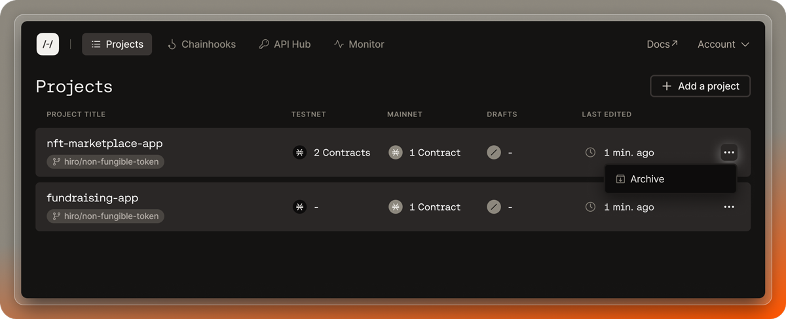
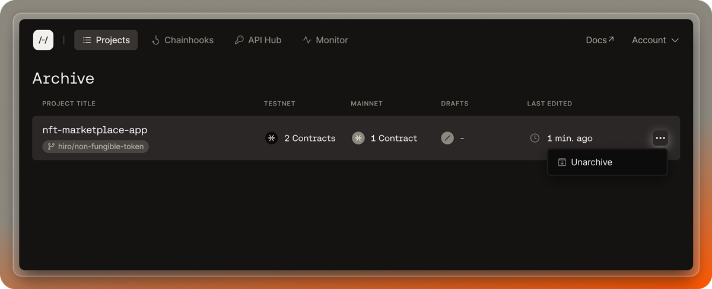

## Archive a project

Sometimes, you may find it necessary to archive a project from your project list. It is important to understand that archiving a project is not the same as deleting a project. Archiving a project means you wish to move the project status from an active project to one that is not active and visible in your project list.

Follow the steps below to archive a project:

1. Sign in to the [Hiro Platform](https://platform.hiro.so/).
2. Once you are authenticated, you will be redirected to the project page.
3. From your list of projects, find the project you wish to archive.
4. Click on the far-right three dots and select "Archive." This will remove the project from the project list and place it into an archive folder.

## Unarchive a project

Follow the steps below to unarchive a project:

1. From the projects page in the Hiro Platform, select the "Archive" button at the top right. and select the far-right three dots and select "Unarchive."
2. You will now see a list of archived projects. Select three-dots on the far right and click "Unarchive" for any project you want to unarchive.
3. You will now see any unarchived projects back in your project list.

<Callout title="Note" type="info">
  Deleting a project is not yet available in the BETA version.
</Callout>
