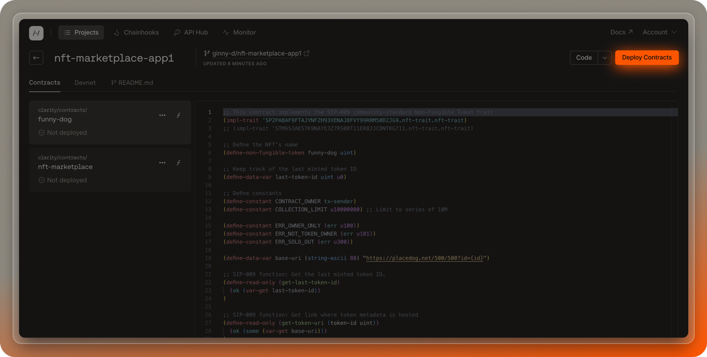
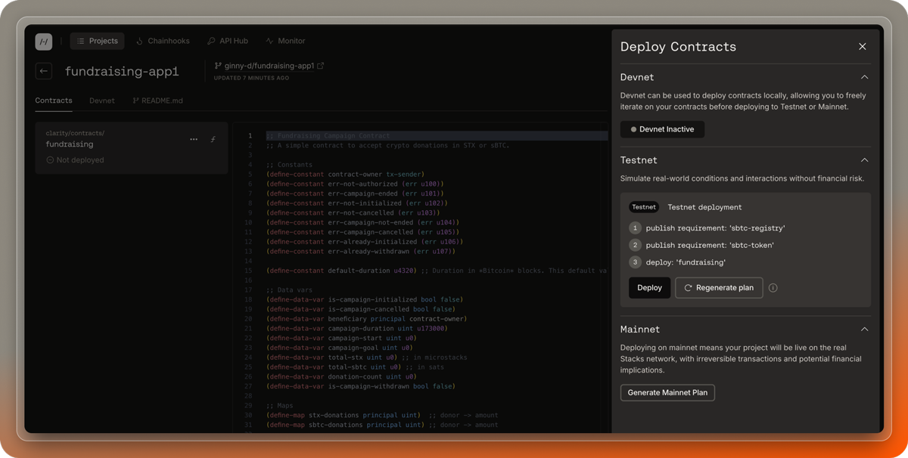

## Prerequisites

- Follow the [create project](/stacks/platform/guides/create-project) guide to create or import a project.
- Make sure you have installed and connected a Stacks wallet to deploy your contracts.

## Use the deploy button

Once your project is setup, you can deploy the contracts to testnet or mainnet using the "Deploy" button on the Hiro Platform.

The following are the steps to deploy your contracts using the deploy button.

1. On the projects page, select the project you want to deploy contracts from.
2. Use the "Deploy Contracts" button available at the top right of the page.
3. Choose the network you want to deploy to. Note: for devnet, [reference this guide](/stacks/platform/guides/devnet). The steps below are specific to testnet and mainnet.
4. Once you choose a network, you will see a button to generate a deployment plan.
5. Once the deployment plan is generated, you will see the list of contracts to be deployed - you can now connect your wallet and click "Deploy" to deploy your contracts.

If you find issues with your deployment process, you can reach out to us on the [#hiro-platform channel](https://stacks.chat) on Discord under the Hiro Developer Tools section or file an issue [here](https://hiro-pbc.canny.io/hiro-platform).
