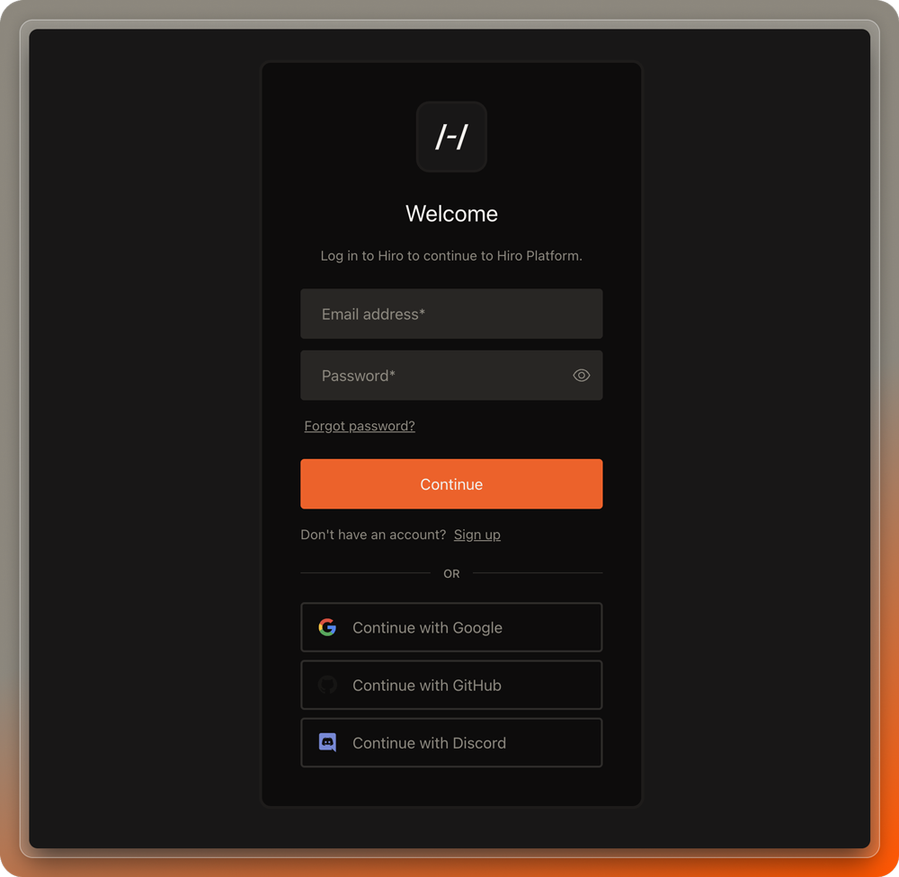
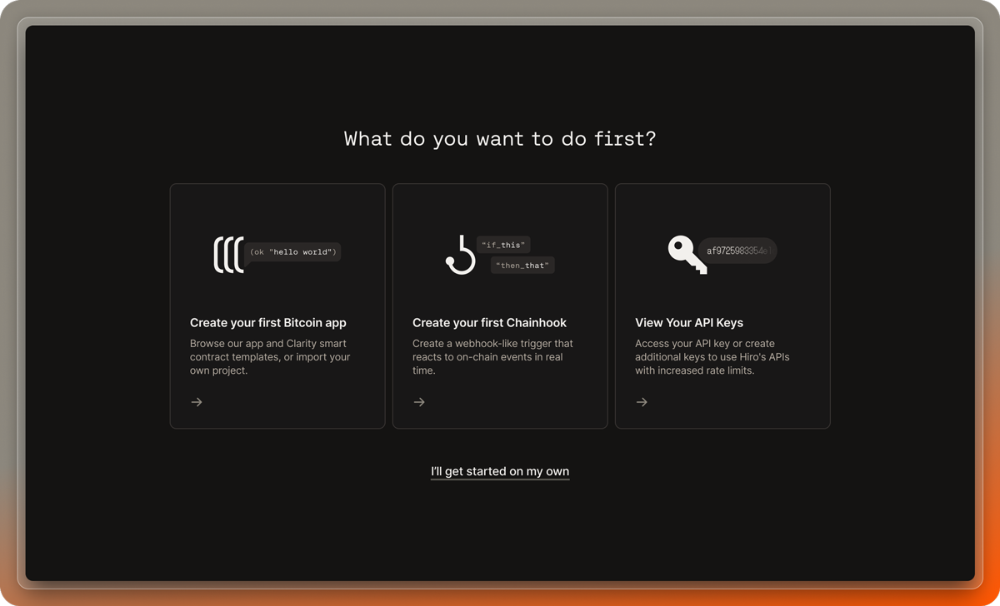
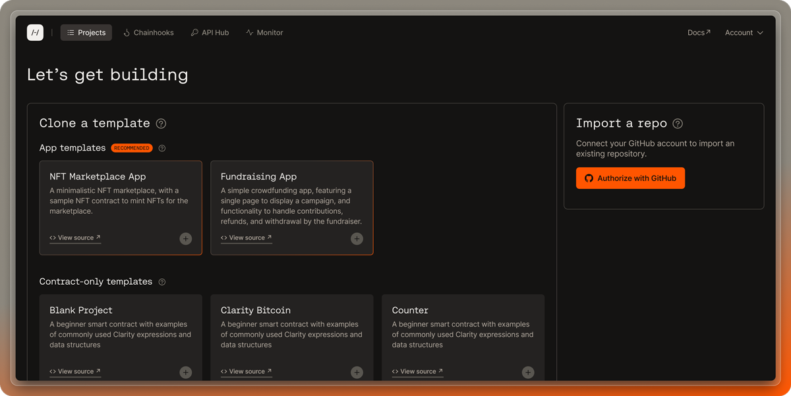
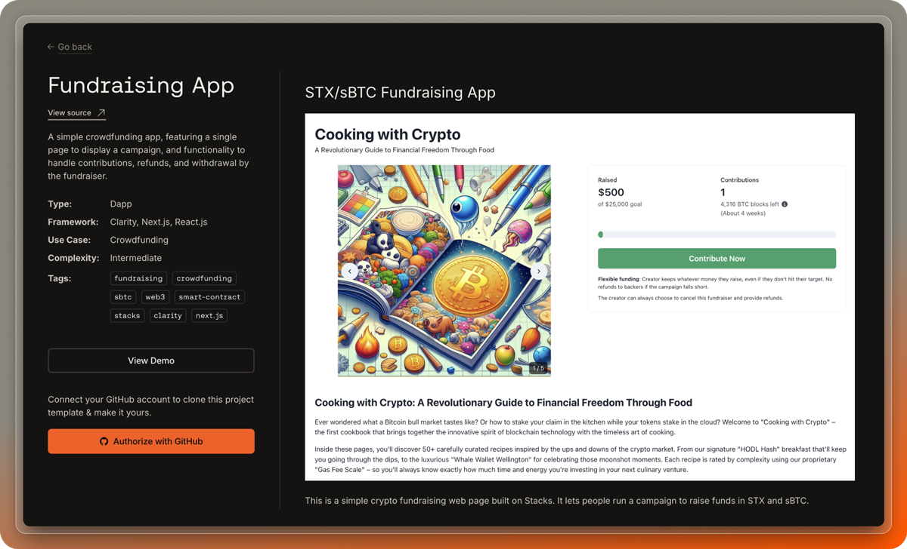
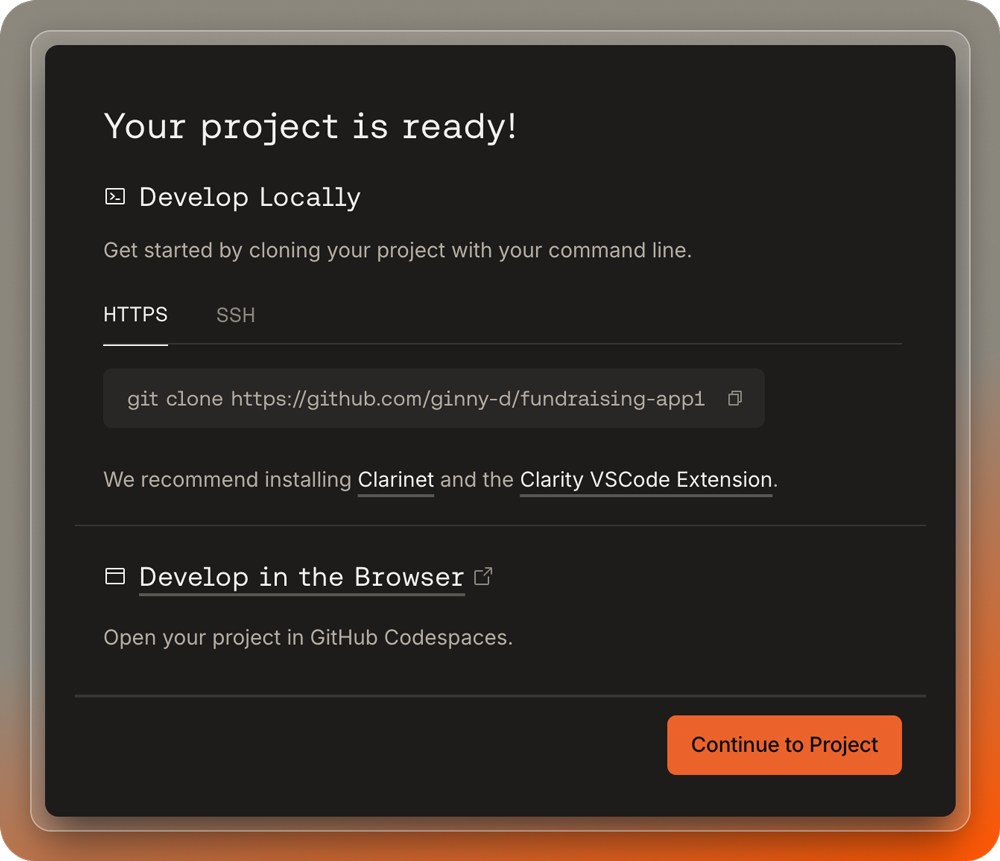

import { Code, Terminal } from "lucide-react"
import { SmallCard } from "@/components/card"

In this quickstart guide, you will create a simple fundraising app using one of the app templates available. This app features a single page that displays a fundraising campaign, and functionality that handles campaign contributions, refunds, and withdrawal by the fundraiser.

## Create your account

Start by creating an account in the Hiro Platform. You can create an account with:

- Email
- Google
- GitHub
- Discord

Once signed in, you will see an onboarding screen showing all the Hiro Platform has to offer:

## Create your project

If you do not have any existing projects, you will be prompted to create one on the projects page. Click the "Add a project" button to get started.

<Callout type="info">
If you already have projects, you can find the "Add a project" button at the top right of the page.
</Callout>

From here, you have the option to choose from a set of templates or import an existing project from your GitHub account. For this quickstart, select the "Fundraising App" template, which is a starter project that comes equipped with both a frontend and smart contracts.

<Callout type="info">
To see a list of your repositories and import an existing project, you will first need to authorize with GitHub.
</Callout>

## Clone your project

Once you have selected your project, you will be presented with the full set of details for the project. From here, you can clone the project to your GitHub account by clicking the "Clone" button.

<Callout type="info">
You will need to authorize with Github before being able to clone the project.
</Callout>

Once the project is ready and available in your GitHub account, you will see instructions on how to clone the project to your local machine or develop in the browser via Github Codespaces.

You are now ready to start building!

## Next steps

<Cards>
  <Card
    href="/stacks/platform/guides/deploy-contracts"
    title="Deploy contracts"
    description="Learn how to deploy your contracts to testnet and mainnet using deployment plans in the Hiro Platform."
  />
  <Card
    href="/stacks/platform/guides/devnet"
    title="Running Devnet"
    description="Learn how to use devnet, a private blockchain environment, to test and interact with your app."
  />
  <Card
    href="/stacks/platform/guides/create-chainhooks"
    title="Create and manage Chainhooks"
    description="Learn how to create custom event streams for Stacks or Bitcoin with Chainhook on the Platform."
  />
</Cards>
