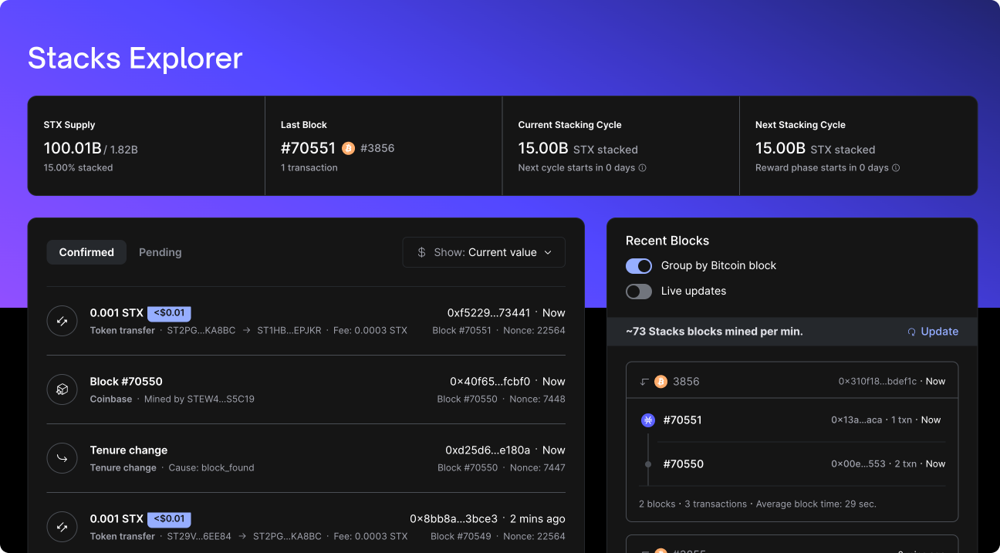
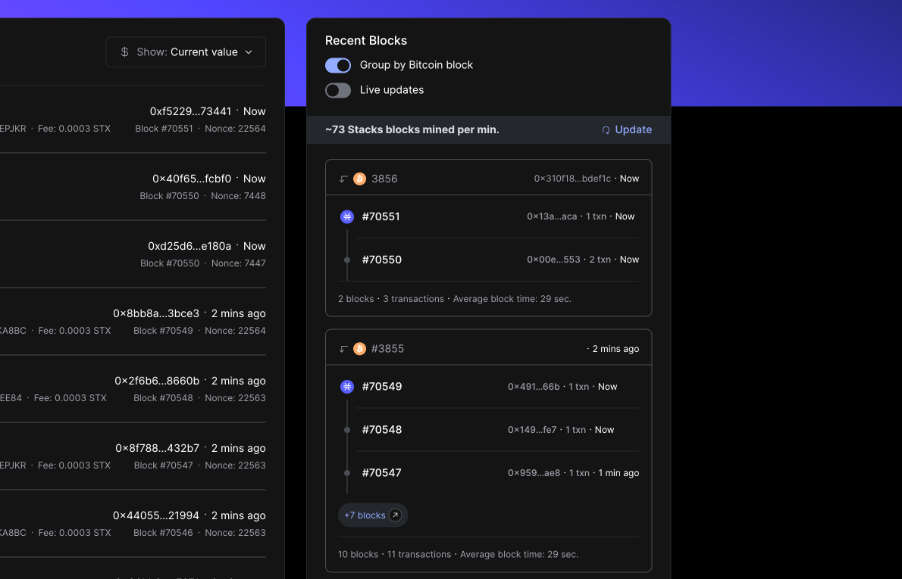

## What's New

### Introducing a Fresh View for Blocks

The Stacks Explorer now features a new way to display blocks, aligning with the Nakamoto upgrade's approach of multiple STX blocks settling into one BTC block.

### Tailored Viewing Experience

This new view is now live on both [Testnet](https://explorer.hiro.so/?chain=testnet) and [Mainnet](https://explorer.hiro.so/?chain=mainnet), accessible via the Network dropdown.

#### Two Distinctive Display Modes

1. **Independent Display:** Focuses on STX blocks progress.
2. **COMING SOON: Grouped by Bitcoin Block:** Shows BTC blocks flow alongside STX blocks.

### Stay in the Loop with Live View

Keep up-to-date with blocks in real-time with our new live view option.
