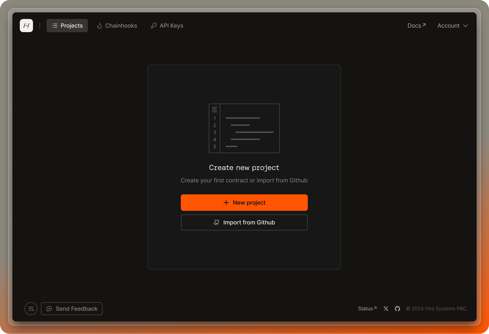
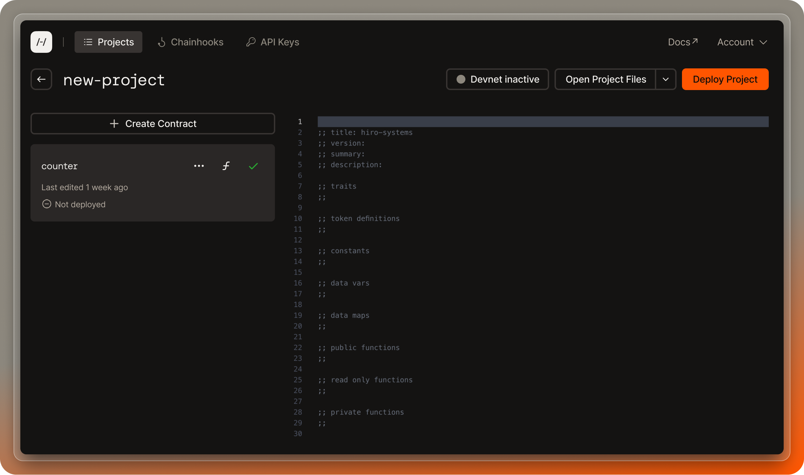
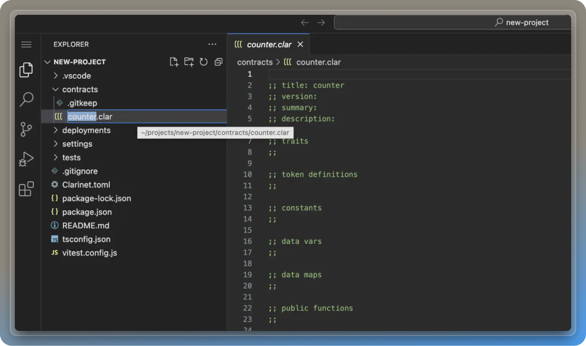

Building contracts on the Hiro Platform allows you to leverage the power of Clarity, a language designed for smart contracts on the Stacks blockchain.

<Callout title="Note">
  If you are new to Clarity programming, check out the [Bitcoin Builders Primer](https://start.bitcoinprimer.dev/).
</Callout>

If you have create or imported a project with no Clarity contracts, you will see a window that prompts you to create a new contract or open a web (or local) editor.



## Write new contracts

To create a new contract, you can simply click the "Create contract" button which will create an empty contract in your project.



You can also create a new contract for your project from the editor by following the steps below. Note: the sample project used here is from [Clarity examples](https://github.com/hirosystems/clarity-examples/tree/main/examples/blank-project), and these steps assume that your project has no Clarity contracts already.

<Callout title="Note">
  Hiro offers a [collection of Clarity smart contracts](https://github.com/hirosystems/clarity-examples/tree/main/examples) in the platform available for you to quickly extend and deploy. Or you can write your own from scratch.
</Callout>

1. Click the "Open in Web Editor" button. If you want to do this locally, you first need to [set up SSH](/stacks/platform/guides/connect-desktop-to-cloud).
2. This will open up a new tab with VS Code editor, and inside VS Code, you will find the project directories and files.
3. Expand "NEW-PROJECT" and see a directory named "contracts". There should be no contracts in this folder yet.
4. Right-click the contracts folder, select "New file", and add a new contract with a name of your choice. Eg: `counter.clar`
   
5. This will create a `.clar` file in the contracts folder. Now you can use the [Clarity examples](https://github.com/hirosystems/clarity-examples) to customize your contract.
6. Once your `.clar` file is ready, you can update the `Clarinet.toml` file located in the same project directory. Use the following code to update the `.toml` file with these parameters. `[contracts.<your-contract-name>]` and path to use your `.clar` file name as `path = "<your-contract-name.clar>"`.

```toml
[project]
name = "new-project"
requirements = []

[contracts.counter]
path = "contracts/counter.clar"
clarity_version = 2
epoch = "2.4"
```

Save the file. You can now deploy your contracts in your project by referring to the [deploy project](/stacks/platform/guides/deploy-project) guide.

## Add a new contract

If you have a project that already has at least one Clarity contract, it's very easy to add more by following the same steps above. If you are using the editor, in the 6th step, where you edit the `Clarinet.toml` file, you will also add two lines of code, as shown below. Note that the below code assumes that the newly added contract is `clarity_contract_2`. You also need to add the path to your new contract as shown below.

```toml
[project]
name = "new-project"
requirements = []

[contracts.counter]
path = "contracts/counter.clar"
clarity_version = 2
epoch = "2.4"

[contracts.clarity_contract_2]  # --> new
path = "contracts/clarity_contract_2.clar" # --> new
clarity_version = 2
epoch = "2.4"
```

## Test contract

You can customize, test, and debug your contracts using the VS Code terminal inside the Hiro Platform. On your projects page, select the "Open editor" button to open up the VS Code editor. Select the three horizontal lines icon to open a new terminal. Refer to the following documents to test your contracts in the VS Code terminal.

- [Check contracts](/stacks/clarinet/guides/validate-a-contract)
- [Test contracts](/stacks/clarinet/guides/testing-with-clarinet-sdk)
- [Debug contracts](/stacks/clarinet/guides/debug-a-contract)

<Callout title="Note">
  **`clarinet devnet start`** and **deployment plans** are currently not supported in
  Clarinet installed inside the VS Code editor of the Hiro Platform.
</Callout>

Once you are done adding, customizing, and testing your contracts, save your files. Now it's time to deploy.
