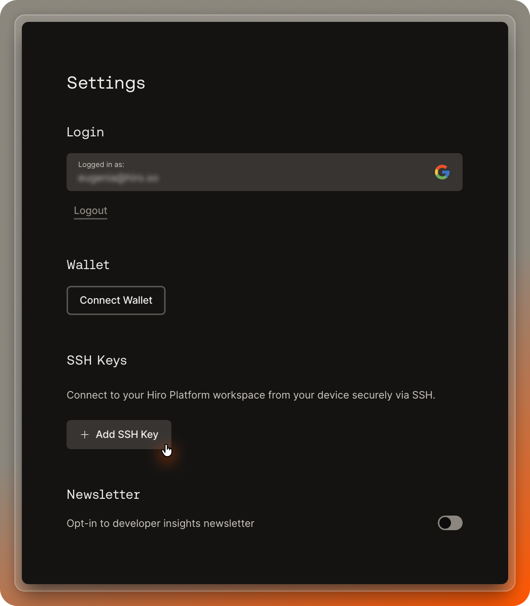

The Hiro Platform now supports local development, allowing you to use your preferred local editor (VS Code, Emacs, Vim, etc.) to develop smart contracts. This guide will walk you through the steps to set up your local editor for the Hiro Platform.



## Find or generate your SSH key

First, you need to check if you already have an existing SSH key on your device. This is often located in `~/.ssh/id_ed25519.pub`. You can view your SSH keys by running the following command in your terminal:

```terminal
$ ls -al ~/.ssh
```

Look for the file ending in `.pub`, which contains your public key.

If you don't have an SSH key, you can generate one by running the following command in your terminal:

```terminal
$ ssh-keygen -t ed25519
```

You'll then be prompted to enter a passphrase. You can choose to leave that blank. You should now have a `id_ed25519.pub` file, which contains your new public SSH key.

## Save your SSH key

Next, you need to provide your public key to the Hiro Platform. You can do this by copying your public key and pasting it into the SSH public key field in the Hiro Platform in Profile -> Settings: [https://platform.hiro.so/settings](https://platform.hiro.so/settings)

For Mac, use:

```terminal
$ cat ~/.ssh/id_ed25519.pub | pbcopy
```

For Windows, use:

```terminal
$ type %userprofile%\.ssh\id_ed25519.pub | clip
```

For Linux, use:

```terminal
$ cat ~/.ssh/id_ed25519.pub | xclip -selection clipboard
```

You'll also need to provide a nickname for your connected device, such as 'MacBook Pro'. This will help you identify the device in the future.

## Enable SSH and Git

To enable SSH access and Git authentication to your Hiro Platform workspace, you'll need to modify your `~/.ssh/config` file. However, before proceeding, it's important to understand what these commands do to ensure you're comfortable with the changes being made to your machine

Here are the lines you need to add:

```bash
Host *.ssh.platform.hiro.so
    User hiro
    StrictHostKeyChecking no
    ProxyCommand openssl s_client -quiet -servername %h -connect %h:22
    ForwardAgent yes
```

<Callout title="Property Descriptions">
See below what each line does:

- `Host *.ssh.platform.hiro.so`: This line specifies that the following settings apply to any host in the `ssh.platform.hiro.so` domain.
- `User hiro`: This line sets the default username to `hiro` for this host.
- `StrictHostKeyChecking no`: This line disables the prompt that asks if you trust the host you're connecting to.
- `ProxyCommand openssl s_client -quiet -servername %h -connect %h:22`: This line tells SSH to use OpenSSL as a proxy to connect to the host.
- `-servername %h`: This option sets the Server Name Indication (SNI). The `%h` is a placeholder that SSH replaces with the host name.
- `ForwardAgent yes`: This line enables the forwarding of the authentication agent connection, which is useful if you're using Git. `ForwardAgent` is an option in SSH that allows your local SSH agent to authenticate on a remote server without storing your private keys on the remote server. When `ForwardAgent` is set to `yes`, the SSH client will forward the authentication information to the remote machine that you SSH into.

If you don't plan to use Git, you can remove the line `ForwardAgent yes`.

</Callout>

## Get your workspace URL

To create an SSH connection to your Hiro Platform workspace, you will need your workspace url. To find it, go to [https://platform.hiro.so/projects](https://platform.hiro.so/projects) and click `Connect Your Local Editor`. You will find your workspace url at the bottom.

## Connection complete!

Now you can access your Hiro Platform projects directly from your local setup. Use an SSH client or editor with SSH support to open your projects.

## Configuring Visual Studio Code

You can use the "Remote-SSH" extension to connect to, and work on, your remote server directly from your local VS Code environment. If you don't have it installed already, you can install it from the [VS Code Marketplace](https://marketplace.visualstudio.com/items?itemName=ms-vscode-remote.remote-ssh).
Once the extension is installed, you can connect to your remote server by following the steps below.

1. Open VS Code on your local machine.

2. Open your user `settings.json` and add the following configuration:

```json
"remote.SSH.serverInstallPath": {
  "<your-workspace-url>": "/home/workspace/projects/",
}
```

3. Open the command palette, select "Remote-SSH: Connect to Host", then paste your `<your-workspace-url>` and hit enter.

4. A new VS Code window will open, connected to your remote server.

5. To view all your Platform hosted projects, click "Open Folder" in the Explorer view and navigate to `/home/workspace/projects/`.

6. You can now open folders and files on the server and work on them as if they were local.

Remember to replace `<your-workspace-url>` with your actual workspace url.

That's it! You've now set up your local editor for Hiro Platform.

## Connecting via Command Line Interface (CLI)

If you prefer using the command line for your development work, you can also connect to your Hiro Platform workspace via SSH using the terminal. Here's how:

1. Open your terminal.

2. Enter the following command:

```terminal
$ ssh hiro@<your-workspace-url>
```

Replace `hiro@<your-workspace-url>` with your actual workspace URL.

3. If this is your first time connecting to the server from your device, you may see a message asking you to confirm the server's fingerprint. Type `yes` and press `Enter`.

4. Once connected, you should be in your remote workspace. You can now navigate through your files and directories using standard Unix commands.

Remember, to ensure a smooth connection, your public SSH key must be registered with the Hiro Platform, as described in Step 2.

## Configuring Emacs

Emacs has built-in support for SSH through the Tramp mode. To open a file over SSH, use the following command:

```terminal
$ C-x C-f /ssh:hiro@<your-workspace-url>:/path/to/project
```

Replace `hiro@<your-workspace-url>` with your workspace url, and `/path/to/project` with the path to the project you want to open.
