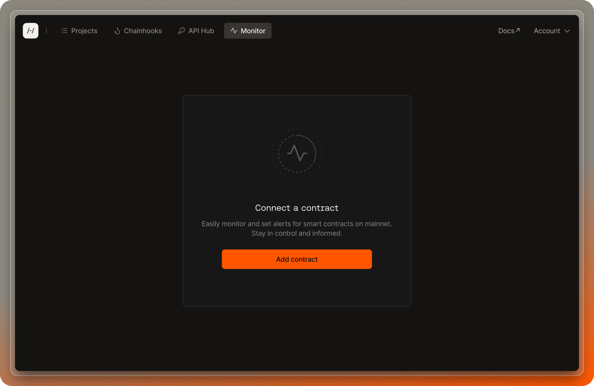
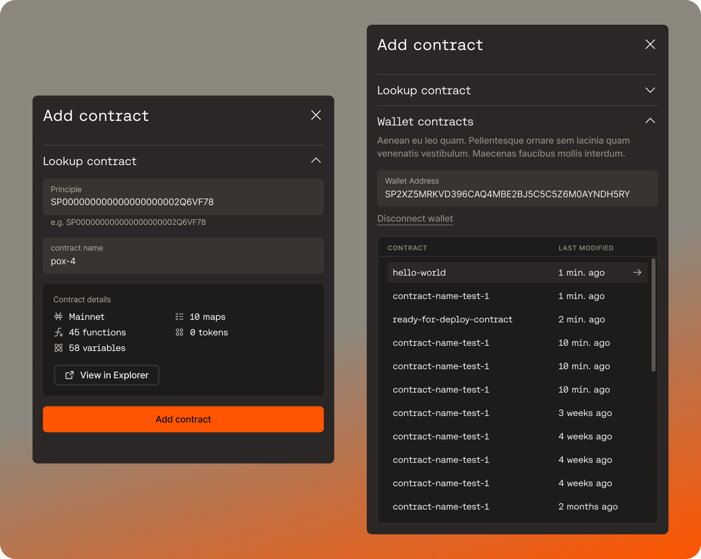
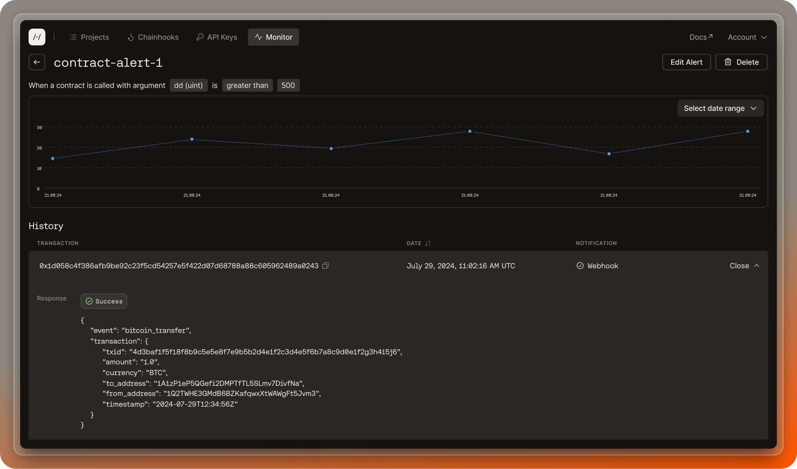

## Prerequisites

- Create or import a project by following the steps in the [create project guide](/stacks/platform/guides/create-project).
- Deploy a project's Clarity smart contract to mainnet by following the [Deployment guide](/stacks/platform/guides/deploy-contracts).

This feature goes beyond just security—it’s also a way to better understand how your contracts are being used. You can also set up alerts for various public functions in your smart contract to gain insight on which functions are receiving the most calls and how users are interacting with your contract.

## Set up contract monitoring

<Callout title="Note">
  Make sure to have successfully deployed your contracts to the Stacks mainnet if you plan on setting up alert monitoring for your own contracts.
</Callout>

If you have successfully deployed your contracts or want to set up alert monitoring for other contracts on mainnet, toggle to the Monitor tab after logging into the [Hiro Platform](https://platform.hiro.so).



## Add contract for monitoring

After clicking on the 'Add contract' button, a slideout modal will appear with fields for you to look up any smart contract on mainnet using the contract's principal and contract name. All contracts deployed to mainnet are public, and you can monitor and set up alerts for any of them, regardless of whether you are the deployer.

Alternatively, you can also connect your wallet to view your deployment history and choose any contracts you’ve previously deployed in order to set up alerts for them.



Your contract will then appear under Contract Monitoring. Once you are monitoring a particular contract, you can view its transaction history and any pending transactions in the mempool. Click on "Create an alert" to create a specific alert you want to monitor for. 


## Add custom alert

You can configure alerts for any contract calls on mainnet, whether that’s a `set-contract-owner` function, a transfer/mint/burn function, or anything else you’ve implemented that you want to monitor.

Once you identify the function calls you want to monitor, you can further hone in on the specific calls by creating filters for argument values and the address of the wallet which called the function. 

The specific conditions you can choose to monitor for include:

- When a particular function is called
- When a particular function is called with a specified argument
- When a particular function is called by a specified address

You can monitor these alerts in the Hiro Platform, and you can also choose to receive email alerts every time one of those alerts is triggered. Alternatively, you can configure webhook calls, which can be used for all kinds of customized alerting flows.


## Monitor your alerts

With each alert you set up, you can view the alert’s history and the response status from any webhook calls made. You also have the ability to edit existing alerts to change your alert conditions or notification preferences at any time.



## What to expect from alerts

If you've specified an email as the notification type, alert notification emails will come from Hiro Platform `<platform@hiro.so>`.

If you've specified a webhook to send an alert to an API endpoint, then the alert payload will look like `sample-alert-payload.json` below.

<Callout type="info">
  Note that `tx_status` will always return a "pending" status for monitor alert notifications. This is because contract monitoring alerts will only send notifications when your custom notification alert on a particular function hits the mempool, but not when it gets confirmed in the blockchain.
</Callout>

<Tabs items={['Sample Alert Payload', 'Alert Payload Interface']}>
  <Tab value="Sample Alert Payload">
    ```json sample-alert-payload.json
    {
      "tx_id": "0xa7f511b3f379efef6fe71d0de57712ed13a89c5b6e24dd049eb2cc9a7c24fcb5",
      "nonce": 5,
      "fee_rate": "250",
      "sender_address": "SP2W9QYAHJNS7YTQY9EK2MSTQGX9E2NDMV766JP9Z",
      "sponsored": false,
      "post_condition_mode": "deny",
      "post_conditions": [
        {
          "type": "stx",
          "condition_code": "sent_equal_to",
          "amount": "3000000",
          "principal": {
            "type_id": "principal_standard",
            "address": "SP2W9QYAHJNS7YTQY9EK2MSTQGX9E2NDMV766JP9Z"
          }
        }
      ],
      "anchor_mode": "any",
      "tx_status": "pending",
      "receipt_time": 1726104636,
      "receipt_time_iso": "2024-09-12T01:30:36.000Z",
      "tx_type": "contract_call",
      "contract_call": {
        "contract_id": "SPHW0EJK5KPDMK03ZX792EMP0Q5J3A39ZMTVZZCY.sample-contract",
        "function_name": "donate",
        "function_signature": "(define-public (donate (amount uint)))",
        "function_args": [
          {
            "hex": "0x01000000000000000000000000002dc6c0",
            "repr": "u3000000",
            "name": "amount",
            "type": "uint"
          }
        ]
      }
    }
    ```
  </Tab>
  <Tab value="Alert Payload Interface">
  ```ts title="sample-alert-interface.ts"
  interface Body {
  tx_id: string;
  nonce: number;
  fee_rate: string;
  sender_address: string;
  sponsored: boolean;
  post_condition_mode: string;
  post_conditions: Postcondition[];
  anchor_mode: string;
  tx_status: string;
  receipt_time: number;
  receipt_time_iso: string;
  tx_type: string;
  contract_call: Contractcall;
  }
  interface Contractcall {
    contract_id: string;
    function_name: string;
    function_signature: string;
    function_args: Functionarg[];
  }
  interface Functionarg {
    hex: string;
    repr: string;
    name: string;
    type: string;
  }
  interface Postcondition {
    type: string;
    condition_code: string;
    amount: string;
    principal: Principal;
  }
  interface Principal {
    type_id: string;
    address: string;
  }
  ```
  </Tab>
</Tabs>