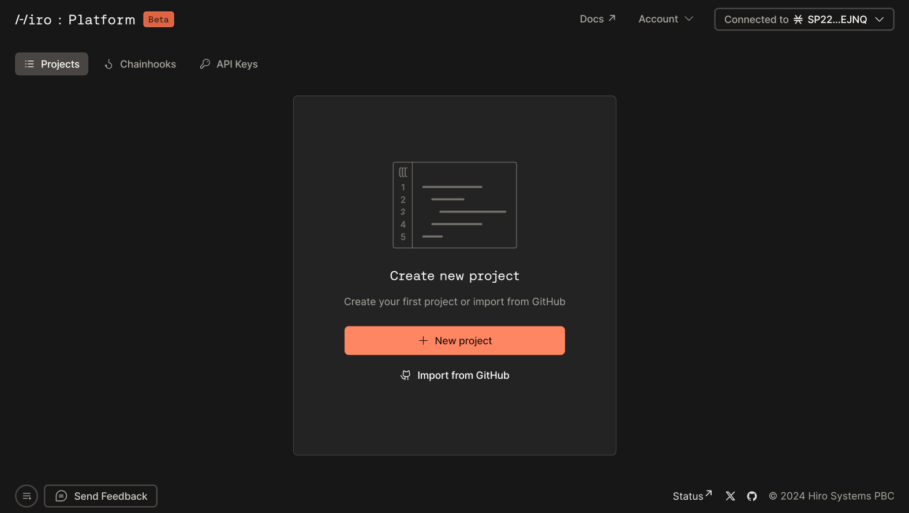
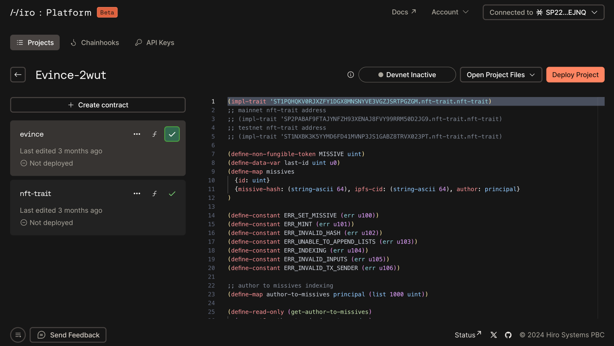

This article walks you through the process of creating a new project or importing a project from GitHub.

## Prerequisite

After you log into the [Hiro Platform](https://platform.hiro.so/), you will be prompted to _create a project_ or _import from GitHub_.

## Create new Project

To create a new project, you can start with a _Blank project_ or use one of the examples displayed in the project modal - Hello world, Ordyswap, Clarity bitcoin, Counter, Fungible token, Lightning swaps, NFT marketplace, Non-fungible token. You can also refer to the examples in the [Clarity examples](https://github.com/hirosystems/clarity-examples/tree/main/examples) to view the source code.

Once you select a new project from the list, the selected example project will be automatically cloned and displayed on the [projects](https://platform.hiro.so) page. Below is the screenshot of the _Hello world_ project.

Now, you can view your projects on the [projects page](https://platform.hiro.so). Select the project to review the list of contracts in them.

## Import Project from GitHub

When you **Import from GitHub**, there will be a modal displayed on the right to enter the GitHub URL of your project.

Once you enter the URL of your project, select _clone_ to clone your project into the Hiro platform.

:::note

The maximum project size allowed for imports is 50 MB.

:::

Your cloned project is now displayed on the [projects page](https://platform.hiro.so).

After your import, your project shows a list of Clarity contracts ending with `.clar` extension, as shown below.

