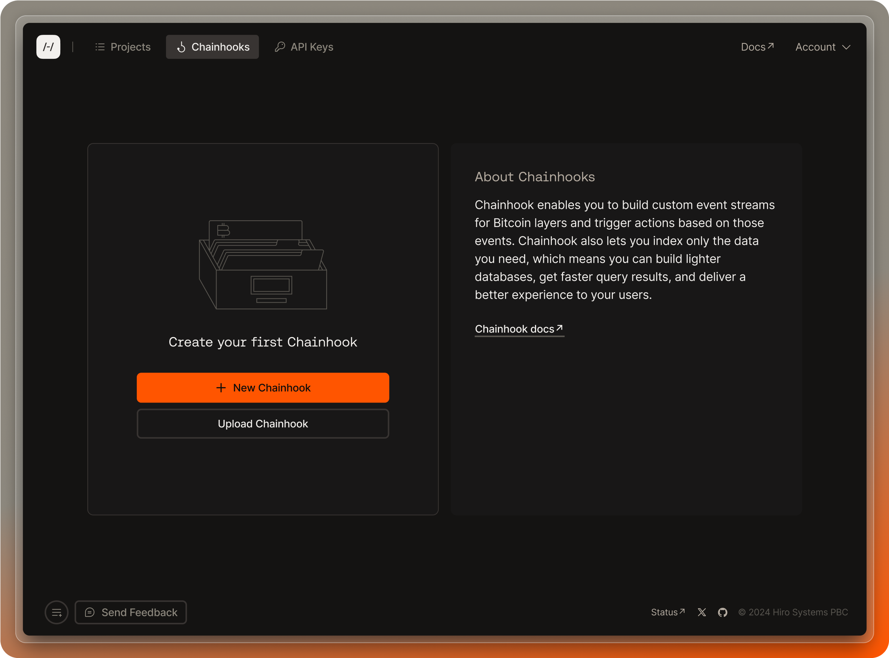
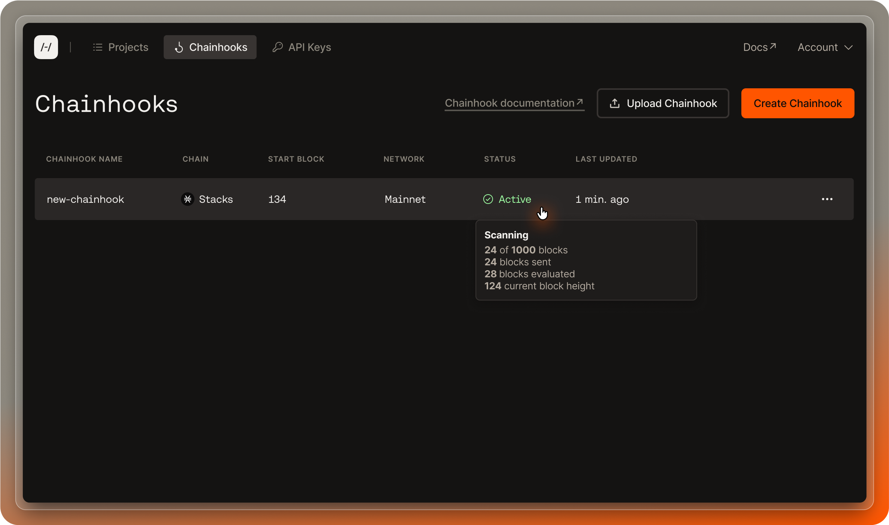

With Chainhook, you can automatically trigger an action in response to on-chain events on Stacks and Bitcoin, enabling you to use IFTTT (if_this, then_that) logic to power your applications. To learn more about Chainhook, refer to the [Chainhook overview](/stacks/chainhook).

To get started in the Hiro Platform, login and toggle to the Chainhook page. There are two ways to create a chainhook. You can either create a chainhook from scratch using the platform UI, or you can upload chainhooks that you have already defined in JSON.

Select the "New Chainhook" button.

This will open a panel on the right to create a chainhook. Use the following fields to create a Chainhook:

**Name**: Input the name of your chainhook.

**Chain**: Select which chain you want to build a chainhook for (Bitcoin or Stacks).

**Network**: Choose which network the chainhook will observe.

**If-this**: Based on the selected chain, you will see a list of available scopes for the `If-this` condition (also called a "predicate").

<Callout title="Available Predicate Scopes">
  -For Bitcoin, the available predicate options are `txid`,`outputs`, and
  `stacks_protocols`.
  
  -For Stacks, the available predicate options are
  `txid`, `block_height`, `fungible_token_event`, `non-fungible_token_event`,
  `stx_event`, `print_event`, and `contract_deployment`.

_Refer to the [Bitcoin predicates](/stacks/chainhook/concepts/bitcoin-predicates) and [Stacks predicates](/stacks/chainhook/concepts/stacks-predicates) documents to understand the available predicates and how to use them._

</Callout>

**Then-that**: This action is defaulted to `http_post` to allow the chainhook to post events to the URL specified in the next field below.

**URL**: Specify a URL to post chainhook events to the HTTP_post method.

**Authorization Header**: This field is optional to add a Secret to the `authorization` header when posting payloads.

**Start Block**: This field must specify the start block to search the chain.

**End Block**: It is optional to specify the end block. However, to optimize your scan time, we recommended you specify this field.

**Expire After Occurrence**: You can specify the chainhook to expire after a specific number of occurrences (a number greater than or equal to 1). You can leave this blank if you don't want to set any limit.

**Decode Clarity Values**: This is enabled by default for Stacks predicates to help you decode Clarity values in your contract.

You'll also see the following options for Bitcoin chainhooks:

**Include Proof**: Enable this option when you have evidence that the transaction or block has been verified and authorized by the sender using their private key. This proof is generally a cryptographic signature to a transaction or block on the Bitcoin blockchain.

**Include Inputs**: Enable this option to include Bitcoin transaction inputs in the payload. In a Bitcoin transaction, inputs are references to previous transactions' outputs (also known as unspent transaction outputs or UTXOs) that are being spent in the current transaction. These inputs provide evidence that the sender has the right to spend the funds.

**Include Outputs**: Enable this option to include Bitcoin transaction outputs in the payload. Including outputs in a Bitcoin transaction refers to specifying the destinations and amounts of Bitcoin being sent as part of a transaction. Outputs in a Bitcoin transaction represent the recipients' addresses and the corresponding amounts of Bitcoin they are receiving.

**Include Witness**: Enable this option to include Bitcoin transaction witness in the payload. The witness data for a transaction includes the cryptographic signatures and other related information placed alongside the transaction data in the block.

Once you define all the required fields, you can select "Create Chainhook", and you can now see your created chainhook on the Chainhook page.

The `NAME`, `CHAIN`, `START BLOCK`, `NETWORK`, `STATUS`, and `LAST UPDATED` headers are updated based on the selected fields used to create a Chainhook.

Based on the chosen network, the respective status columns in the Chainhook list page will be updated to "Deployed."

Note: there may be other fields in the UI to create a Chainhook based on the predicates defined above.

## Upload a chainhook

To upload a chainhook, you can either select the "Upload Chainhook" button and choose the .json file that has the chainhook(s) you want to upload, or you can drag and drop the .json file into the file upload area.

The upload file must be a .json file containing either a single json object representing a Chainhook predicate, or an array of json objects representing one or more Chainhook predicates.

Refer to the [Bitcoin predicates](/stacks/chainhook/concepts/bitcoin-predicates) and [Stacks predicates](/stacks/chainhook/concepts/stacks-predicates) documents to understand the available predicates and how to prepare your Chainhook predicate JSON for upload.

## Edit a chainhook

Once a chainhook is created, you can edit the chainhook by clicking the ellipse on the specific chainhook you want to edit.

Update the fields to reflect your desired changes and then select "Update chainhook."

## Duplicate a chainhook

Select the ellipse on the chainhook you want to duplicate and select "Duplicate." This opens a right pane with all the fields populated to use to create a duplicate Chainhook.

You can update any fields or publish a direct copy by clicking "Create Chainhook."

## Delete a chainhook

Select the ellipse on the chainhook you wish to delete and select "Delete." You will see a confirmation window to confirm if you want to delete the Chainhook.

## Chainhook status

The Chainhook page has a `STATUS` column that displays whether your chainhooks are in an active, inactive, or error state. Active means the Chainhook is actively scanning blocks against its defined predicate, inactive means the Chainhook has reached a terminal state (e.g. its end block has been reached, and it is no longer scanning blocks), and error means the Chainhook ran into an error during its execution.

More status info can be found by hovering over the status element. For example, to understand why the Chainhook is in an error state, hover over the status element to find out.

## References

- [Use Chainhooks with Bitcoin](/stacks/chainhook/concepts/bitcoin-predicates)
- [Use Chainhooks with Stacks](/stacks/chainhook/concepts/stacks-predicates)
- [Run Chainhook as a service using Bitcoind](/stacks/chainhook/guides/chainhook-as-a-service)
- [Run Chainhook as a service using Stacks](/stacks/chainhook/guides/chainhook-as-a-service-with-stacks-node)
