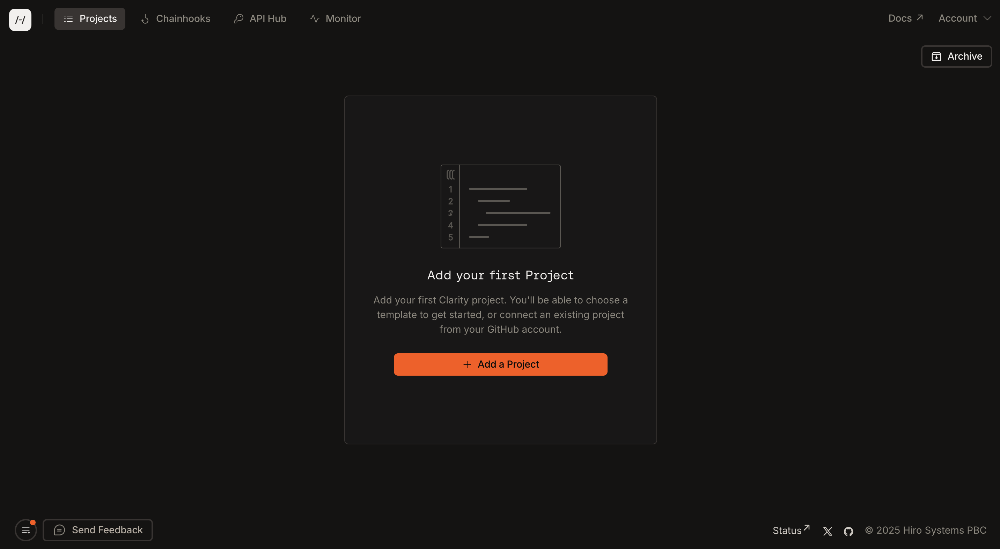
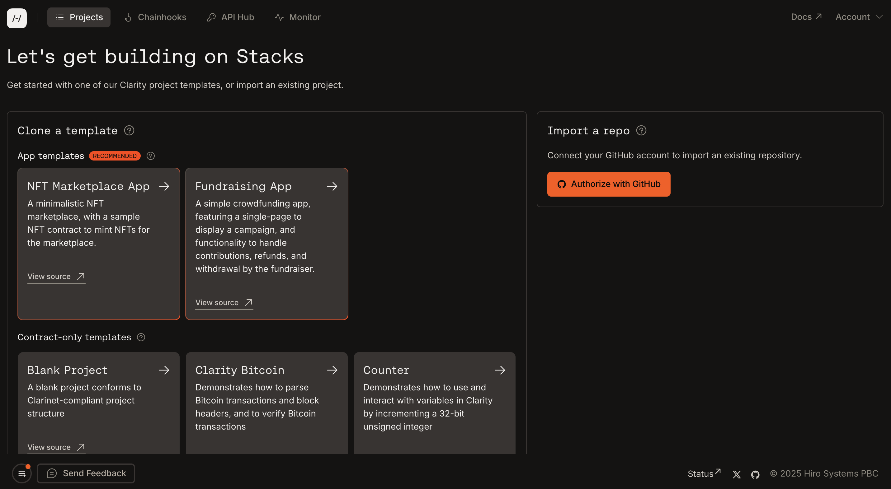
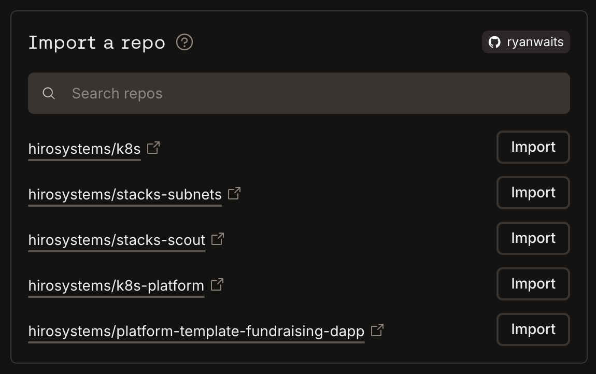

import { Code, Terminal } from "lucide-react"
import { SmallCard } from "@/components/card"

import { Callout } from "@/components/callout"
import { Card, Cards } from "@/components/card"

The Hiro Platform offers multiple ways to create projects, whether you're starting from scratch with a template or importing an existing repository. This guide will walk you through both approaches.

## Add a project

From the main projects page, click the "Add a project" button to begin creating a new project.

## Using templates

The Platform provides 2 types of pre-built templates to help you get started quickly:

1. App templates
2. Contract-only templates

**App templates** are pre-configured with a frontend and smart contracts to help you start building immediately.

**Contract-only templates** are pre-configured with a smart contract to help you start building immediately.

Simply select the template you want to get started with to open up a more detailed view of the app.

Once you are ready, click the "Clone" button to copy the template to your GitHub account. From there, you will see instructions on how to clone the repository locally to start development.

## Importing existing projects

If you have an existing project on GitHub, you can import it directly into the Hiro Platform:

1. If you haven't already, authorize your GitHub account with the Hiro Platform
2. You'll see a list of your repositories that can be imported
3. Select the repository you want by clicking the "Import" button

Once your project is ready, you will see instructions on next steps to get started.

## Next steps

<Cards>
  <Card
    href="/stacks/platform/quickstart"
    title="Quickstart Guide"
    description="Follow our quickstart guide to deploy your first smart contract application."
  />
  <Card
    href="/stacks/platform/guides/devnet"
    title="Running Devnet"
    description="Learn how to use devnet to test your smart contracts in a local environment."
  />
</Cards>