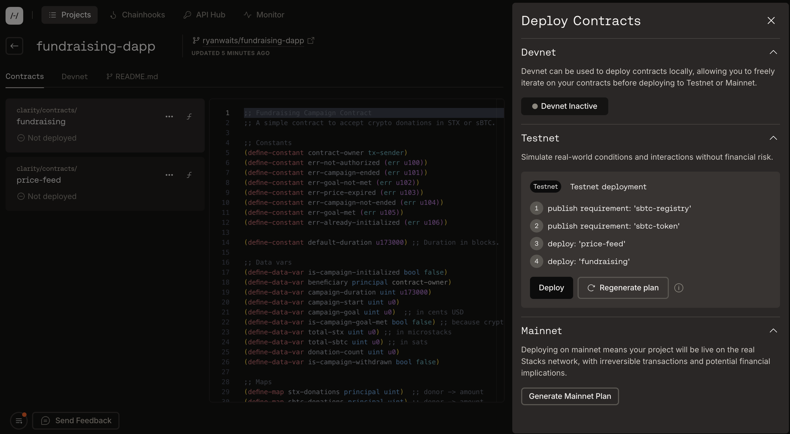
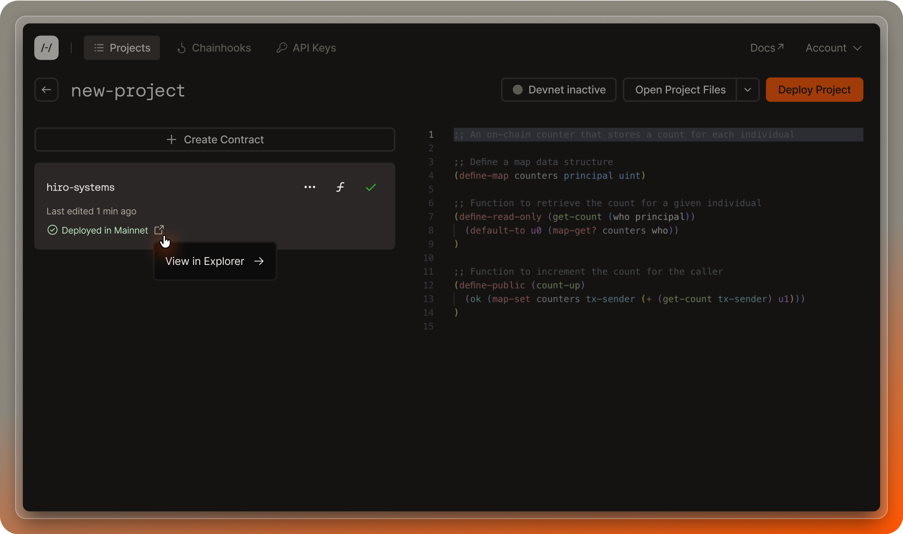
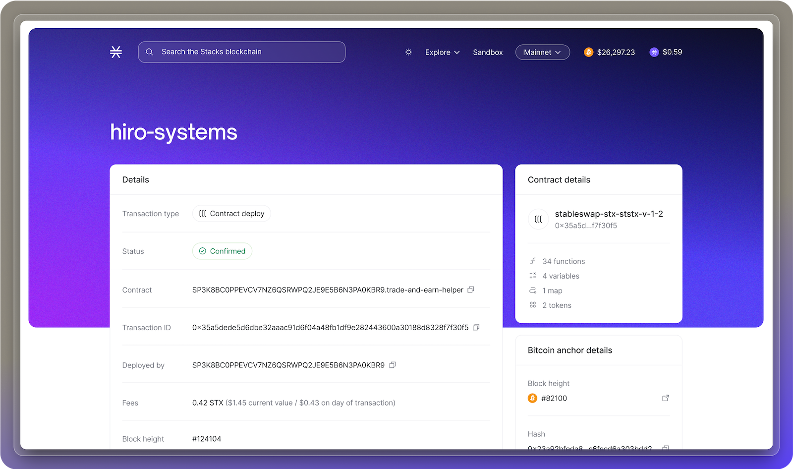

## Prerequisites

- Follow the [create project](/stacks/platform/guides/create-project) guide to create or import a project.
- Make sure you have installed and connected a Stacks wallet to deploy your contracts.

## Use the deploy button

Once your smart contracts are ready, you can deploy them to a [Stacks network](/stacks/clarinet/concepts#network-types), including devnet, testnet or mainnet, using the "Deploy" button on the Hiro Platform.

Note: in general, we recommend deploying contracts via [deployment plans](/stacks/platform/guides/deployment-plans). This guide walks through deploying contracts on a one-off basis, which should be handled with caution.

The following are the steps to deploy your contracts using the deploy button.

1. On the projects page, select the project you want to deploy contracts from.
2. Use the "Deploy Contracts" button available at the top right of the page.
3. Choose the network you want to deploy to. Note: for devnet, [reference this guide](/stacks/platform/guides/devnet). The steps below are specific to testnet and mainnet.
4. Once you choose a network, you will see a button to generate a deployment plan.
5. Once the deployment plan is generated, you will see the list of contracts to be deployed - you can now connect your wallet and click "Deploy" to deploy your contracts.

## Monitor your contract in the Stacks Explorer

At any time, you can monitor your contract in the [Stacks Explorer](https://explorer.hiro.so/?chain=mainnet).

1. You can use the Pop-out button "View in Explorer" beside the deployment status to monitor your contract in the Explorer.

2. This button will open the Explorer to a page showing the contract you just deployed. From this page, you can see relevant information about your contract and the contract details.

If you find issues with your deployment process, you can reach out to us on the [#hiro-platform channel](https://stacks.chat) on Discord under the Hiro Developer Tools section or file an issue [here](https://hiro-pbc.canny.io/hiro-platform).
