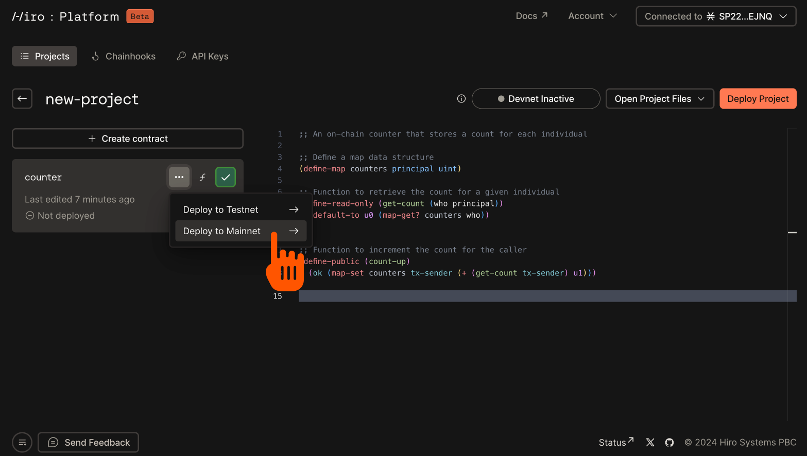
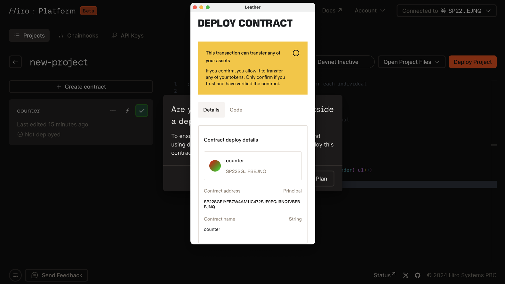
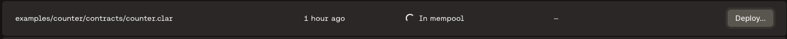
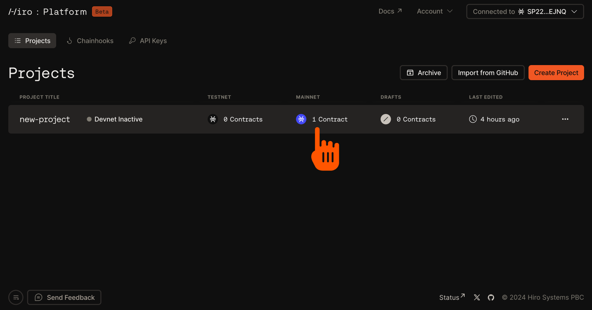
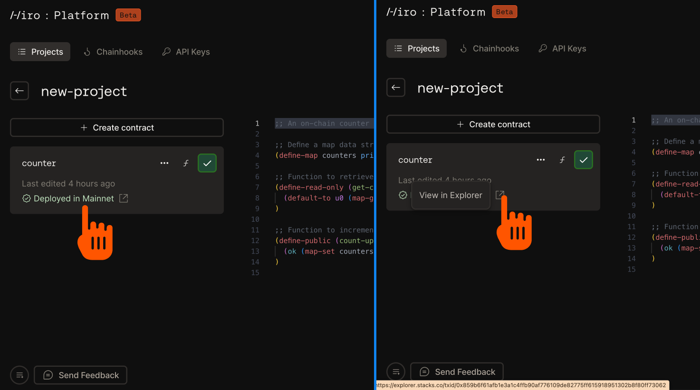
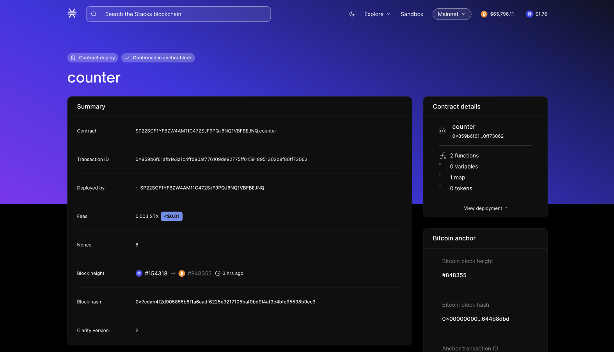

## Prerequisites

- Follow the [create project](create-project) guide to create or import a project.
- Follow the [build contract](build-contracts) guide to create or customize your smart contracts.
- Make sure you have installed and connected a Stacks wallet to deploy your contracts.

## Use the deploy button

Once your smart contracts are ready, you can deploy them to a [Stacks network](/stacks/clarinet#network-types), including devnet, testnet or mainnet, using the _Deploy_ button on the Hiro Platform.

The following are the steps to deploy your contracts using the **Deploy** button.

1. On the projects page, select the project you want to deploy.
2. In the list of the contracts displayed for the project, select the contract you want to deploy.
3. Use the _Deploy_ button available on the right side of the contract.
4. Choose the network you want to deploy to. Note: for devnet, [reference this guide](/stacks/platform/guides/devnet). The steps below are specific to testnet and mainnet.
   
5. Once you choose testnet or mainnet, a pop-up window will open and prompt you to connect your wallet and confirm the deployment.

   

6. While the deployment is in progress, you will see the contract status as _In mempool_ under the environment field for the contract.

   

7. Once the deployment is confirmed, that status will update to _Deployed_ under the chosen environment.

   

## Monitor your contract in the Stacks Explorer

At any time, you can monitor your contract in the [Stacks Explorer](https://explorer.hiro.so/?chain=mainnet).

1. You can use the Pop-out button _View explorer_ beside the _deployed_ status to monitor your contract in the Explorer.
   
2. This button will open the Explorer to a page showing the contract you just deployed. From this page, you can see relevant information about your contract and the contract details.
   

If you find issues with your deployment process, you can refer to the [FAQ section](/stacks/platform/faqs) or file an issue [here](https://hiro-pbc.canny.io/hiro-platform).
