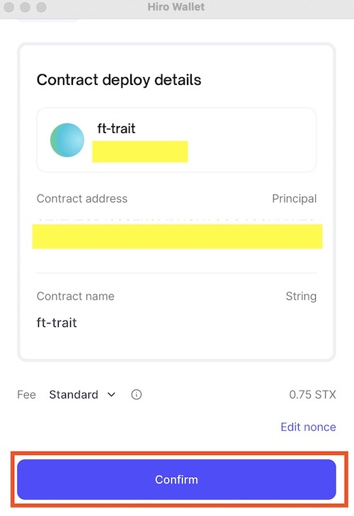

Deployment plans are a collection of transactions that publish one or more contracts to a network (testnet or mainnet). This guide will show you how to deploy your contracts using deployment plans in the Hiro Platform.

To learn more about deployment plans, refer to the [deployment plans guide](/stacks/clarinet/guides/create-deployment-plans) for Clarinet.

## Generate a deployment plan

To generate a deployment plan, you'll need a project with contracts ready to deploy. Refer to the [create a project](/stacks/platform/guides/create-project) and [build contracts](/stacks/platform/guides/build-contracts) guides if you haven't taken those steps yet.

To launch the deployment plans side bar, select the "Deploy project" button on the top right corner of the page.

This brings up the deployment plans side bar, where you can select the network to deploy the contracts using deployment plans.

## Deploy your project

For this guide, generate a deployment plan for testnet.

- Select "Generate for Testnet" to create a deployment plan for that network.
- Next, select "Deploy" to deploy that plan and publish your contracts to testnet.
- This will prompt you to connect your wallet, so you can confirm the deployment.

- Now, in your list of contracts, you will see the status of your deployment as "In mempool."

{" "}

<Callout title="Note" type="info">
  The deployment process may take a while based on the blockchain traffic at the
  time of deployment.
</Callout>

- Upon successful deployment, the status will change to "Deployed."

- It's possible that the transaction may fail in the deployment process for a number of different reasons, in which case you will see the status updated as "Failed." If you want to understand more details about why the deployment failed, you can view the transaction in the Stacks Explorer by selecting the pop-out arrow beside the contract.

## Deploy individual contract

If you want to deploy an individual contract (and not the entire project), you can click the three dots next to the contract name in your project list and click "Deploy to testnet" or "Deploy to mainnet." You will then be prompted to confirm if you want to deploy outside of your deployment plan or use a deployment plan. If you choose to deploy using a deployment plan, follow the steps described above in this article's [deploy](#deploy) section.

## Regenerate deployment plan

The **Regenerate plan** feature in deployment plans is helpful when you have changes in your project (such as adding a new contract), and you need to generate a new deployment plan to account for any new contract dependencies.

## Add/update contracts

If you want to create or update a new contract, refer to this [guide](/stacks/platform/guides/build-contracts). You can also use the "Open Editor" button to open Visual Studio code to add a new contract.

<Callout title="Note" type="info">
  If you add a new contract through Editor, ensure the new contract is
  configured to the `Clarinet.toml` file. For guidance, refer to [Clarinet.toml
  configuration for new contracts](./build-contract.md#add-a-new-contract). You
  can also check your contracts before deploying them by following the [Check
  contract]() guide.
</Callout>

You can then use the **Regenerate plan** button to update your deployment plan with your new or updated contract.

## Remove a deployment plan

Select the "Remove" button to remove the generated deployment plan.

## Additional resources

- [Deployment plans video walkthrough](https://www.youtube.com/watch?v=YcIg5VCO98s)
- [Debug contract](/stacks/clarinet/guides/debug-a-contract)
- [Test contract](/stacks/clarinet/guides/testing-with-clarinet-sdk)
- [Customize deployment](/stacks/clarinet/guides/create-deployment-plans)
