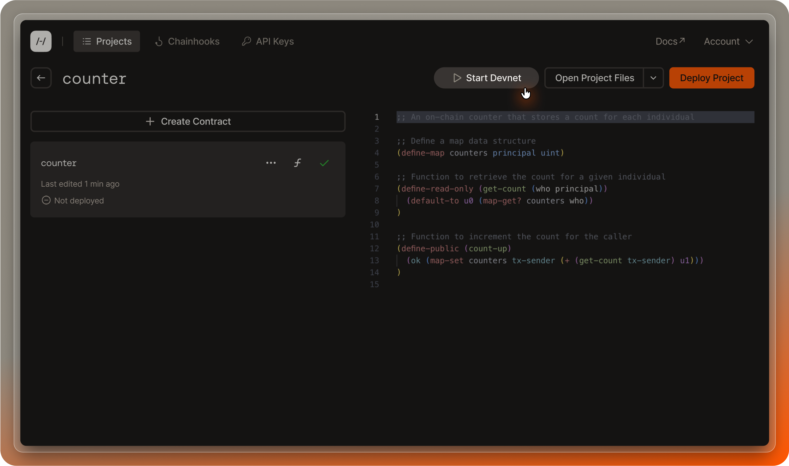
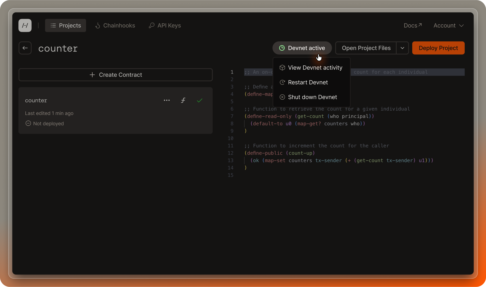
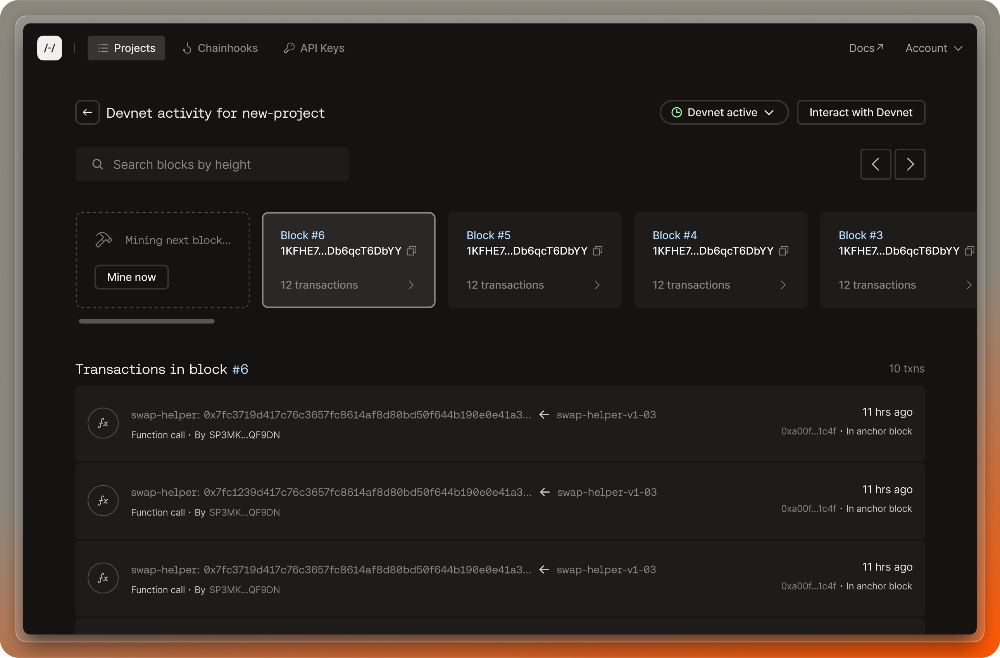
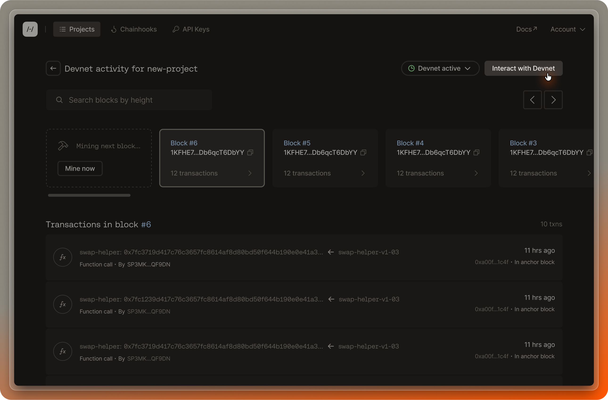
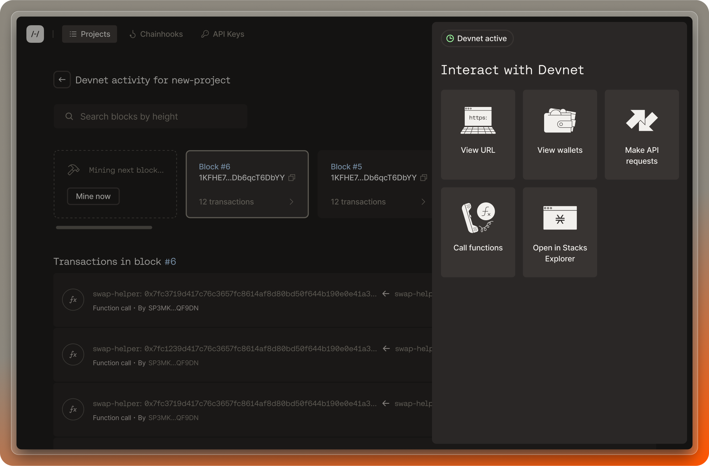

Devnet is a local blockchain environment that lets you test and validate your contract code before deploying on a public network like testnet or mainnet. In this guide, you'll learn how to interact with devnet in the Hiro Platform to expedite your development.

## What is devnet?

Devnet is a configurable, local blockchain environment, allowing developers to deploy and test smart contracts quickly. Think of it like a personal sandbox: no one else can see your devnet instance. You don't have to worry about breaking it, and you can stop and restart it as many times as you need. It comes with blockchain nodes and miners and will product blocks on your local machine.

Devnet provides a risk-free testing ground with the convenience of rapid prototyping, cost savings, and privacy.

## Benefits of devnet

Devnet facilitates:

- **Rapid prototyping**: Quick iterations with immediate feedback.
- **Cost-efficiency**: No real cryptocurrency expenses for testing.
- **Customizable testing environment**: Tailor your blockchain parameters as needed.
- **Isolated development**: A sandbox for confidential and secure testing.

## Using devnet in the Hiro Platform

First, log into the [Hiro Platform](https://platform.hiro.so/). After [setting up your project](/stacks/platform/guides/create-project), navigate to the project page where you'll manage devnet.

## Starting and managing devnet

In the top right corner of your project page, you'll notice a devnet status indicator. Initially, it should read "Inactive." Click on this indicator to reveal a dropdown menu. From here, select "Start Devnet" to initiate your private devnet instance.

If you want to configure your devnet (like you can locally using `clarinet devnet start` in the terminal), open your project's `devnet.toml` file in the platform VS Code editor before you start devnet. From there, you can configure the settings to match your development needs.

Once you start devnet, it will take a few moments to spin up. The status indicator on the project dashboard will keep you updated on the progress.

## Active session management

When devnet is ready, the status will change to 'Active'.

If needed, you can restart devnet to refresh the timer. Keep in mind that only one devnet instance can run at a time per user account. If you need to work on a different project, simply start devnet within that project to seamlessly transition your session. There is also a monthly limit of 100 devnet sessions per account, so plan your development schedule accordingly.

## Exploring the devnet dashboard

With devnet active, clicking on the status pill again will present the option to "View Devnet Details." Selecting this takes you to the devnet dashboard, where you can interact with a block explorer and an "assembly line" of mined blocks. Transactions within each block are accessible here, and a search function is available for efficient block navigation.

## Additional devnet features

On the dashboard, you can also click the "Interact with devnet" button to call contract functions, make API requests, view devnet wallets, and more.

For more information on devnet features, [start here](https://www.hiro.so/blog/5-ways-to-interact-with-devnet-in-the-hiro-platform).

