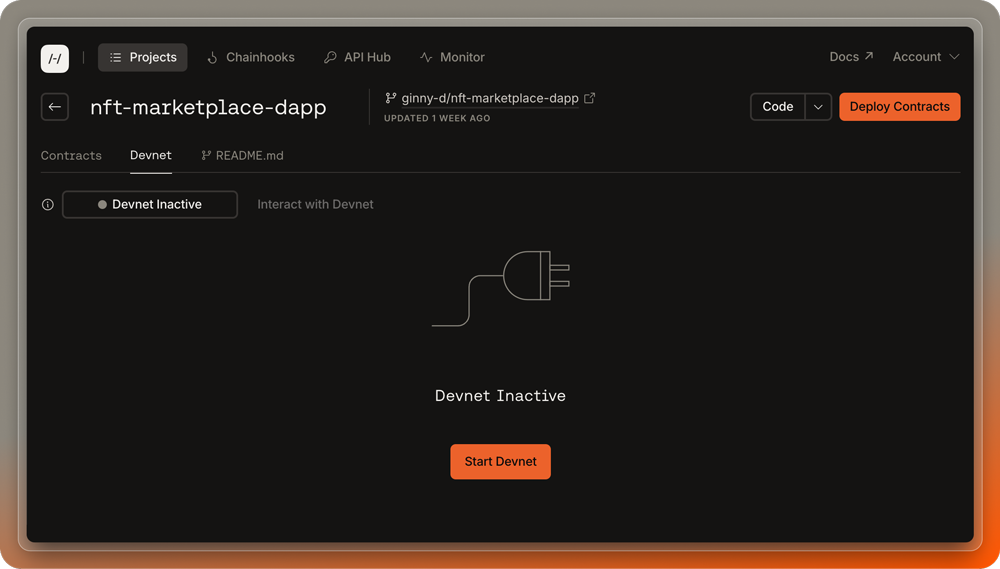
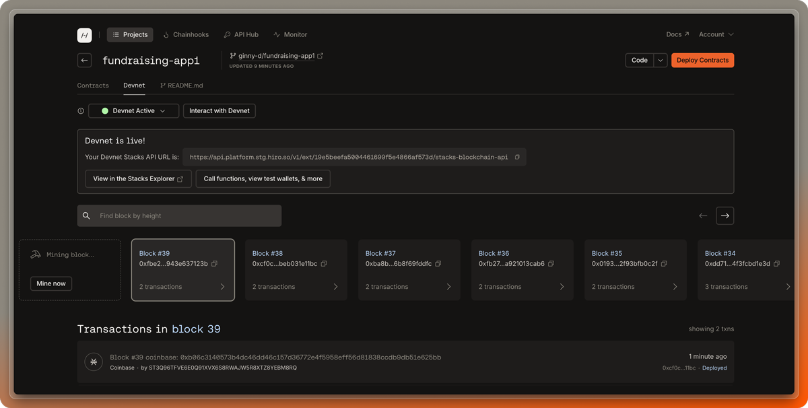

Devnet is a personal blockchain environment that lets you test and validate your contract code before deploying on a public network like testnet or mainnet. In this guide, you'll learn how to interact with devnet in the Hiro Platform to expedite your development.

## What is devnet?

Devnet is a private blockchain environment that lets you test and validate smart contracts quickly. Think of it as your personal sandbox: no one else can see your devnet instance, you don't have to worry about breaking it, and you can stop and restart it as many times as you need.

While developers can run devnet locally using Clarinet, the Hiro Platform provides a hosted version that eliminates the need to manage blockchain nodes and miners on your machine. The Platform-hosted devnet still produces blocks and processes transactions, but offloads the computational overhead to our infrastructure while providing a more intuitive interface for development.

Devnet provides a risk-free testing ground with the convenience of rapid prototyping, cost savings, and privacy.

## Benefits of devnet on the Hiro Platform

The Platform-hosted devnet offers several advantages:

- **Zero local setup**: No need to configure or maintain blockchain nodes locally
- **Resource-efficient**: Offloads computational demands to our infrastructure
- **Rapid prototyping**: Quick iterations with immediate feedback
- **Cost-efficiency**: No real cryptocurrency expenses for testing
- **Seamless local integration**: Connect your local development environment to the hosted devnet
- **Isolated development**: A personal sandbox for confidential and secure testing

## Using devnet in the Hiro Platform

First, log into the [Hiro Platform](https://platform.hiro.so/). After [setting up your project](/stacks/platform/guides/create-project), navigate to the project page where you can select the "Devnet" tab to manage your devnet instance.

## Starting and managing devnet

In your project page, you'll click on the "Devnet" tab to start and manage your devnet instance. Initially, it should read "Inactive." Click on the "Start Devnet" button to start your private devnet instance.

<Callout title="Programmatic API">
  You can also start and stop devnet programmatically via the [Platform API](/stacks/platform-api/devnet).
</Callout>

If you want to configure your devnet (like you can locally using `clarinet devnet start` in the terminal), open your project's `devnet.toml` file in the platform VS Code editor before you start devnet. From there, you can configure the settings to match your development needs.

Once you start devnet, it will take a few moments to spin up. The status indicator on the project dashboard will keep you updated on the progress.

## Active session management

When devnet is ready, the status will change to 'Active'.

If needed, you can restart devnet to refresh the timer. Keep in mind that only one devnet instance can run at a time per user account. If you need to work on a different project, simply start devnet within that project to seamlessly transition your session. There is also a monthly limit of 100 devnet sessions per account, so plan your development schedule accordingly.

## Exploring the devnet dashboard

The Platform's devnet dashboard provides a comprehensive interface for monitoring and interacting with your private blockchain. You can:

- Track real-time block production through the visual "assembly line"
- Inspect block contents and transaction details
- Search through blocks efficiently
- Monitor contract deployments and function calls
- Mint new blocks on demand

## Additional devnet features

On the dashboard, you can also click the "Interact with devnet" button to call contract functions, make API requests, view devnet wallets, and more.

For more information on devnet features, [start here](https://www.hiro.so/blog/5-ways-to-interact-with-devnet-in-the-hiro-platform).
