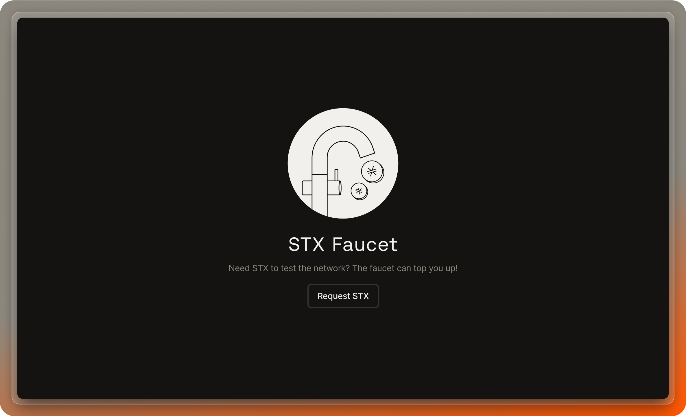

The Stacks Testnet Faucet is a dedicated utility for developers building on the Stacks blockchain. To aid you in deploying and running smart contracts on Stacks testnet, we've provided this faucet that offers easy access to testnet STX tokens.

## Why use the Stacks Testnet Faucet?

Building and testing on a blockchain requires a certain amount of native tokens to facilitate various operations, from contract deployments to transaction executions. However, sourcing these tokens can often be cumbersome. The Stacks Testnet Faucet simplifies this by offering a hassle-free way to acquire STX tokens for testing purposes.

## How to request testnet STX

1. **Visit the faucet page**: Navigate to [platform.hiro.so/faucet](https://platform.hiro.so/faucet).
2. **Select the token**: Select which token you want, either STX or sBTC.
3. **Request tokens**: You'll find a straightforward interface with a button to request tokens. Simply click on the button "Receive x STX/sBTC."
4. **Receive 500 STX tokens or 1 sBTC**: By clicking the button, you'll receive 500 STX tokens or 1 sBTC to your testnet account.

## Frequently Asked Questions

<Accordions>
<Accordion title="What is a faucet?">
A faucet is an application that dispenses free tokens on a Testnet (a blockchain network used for development and testing). The Stacks faucet provides developers with free test tokens for deploying, testing, and optimizing smart contracts that leverage STX and sBTC.

**It's important to remember that Testnet tokens have no real-world value and cannot be sold or used on the main Stacks network.**
</Accordion>
<Accordion title="How does the faucet work?">
Select the type of test token you wish to receive and enter the wallet address where you want to receive them. The faucet will create a transaction on the Stacks Testnet that sends a small amount of test tokens to the provided address.

If you're curious, you can track the transaction's status using [Stacks Explorer](https://explorer.stacks.so/).
</Accordion>
<Accordion title="Is it secure?">
We securely handle the wallet address you provide while processing your request. This data is not used or shared with any other Hiro services.
</Accordion>
<Accordion title="Is there a limit for the number of tokens I can request?">
You can make up to 5 requests every 5 minutes. For more details, see our [rate limiting policies](/stacks/rate-limiting).
</Accordion>
<Accordion title="How long does it take for the Testnet tokens to arrive in my account?">
The time for tokens to arrive to your wallet depends on how busy the network is. On average, it should take x amount of time. If the transaction seems stuck, feel free to reach out to us on our [support channel](https://stacks.chat/).
</Accordion>
</Accordions>

<Callout type="info">
  **Daily Limit**: To ensure fair distribution and availability for all
  developers, there's a limit of one request per day. Plan your testing
  accordingly!
</Callout>{" "}
