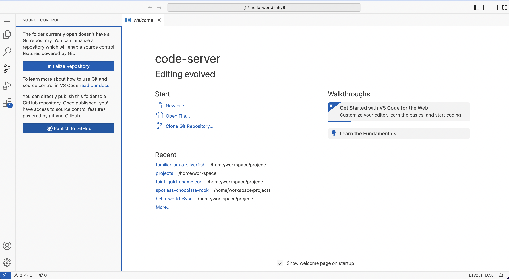
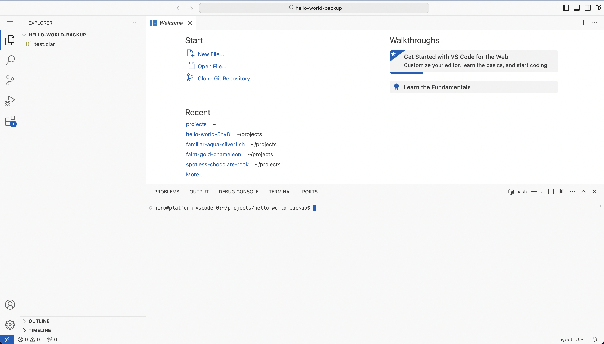
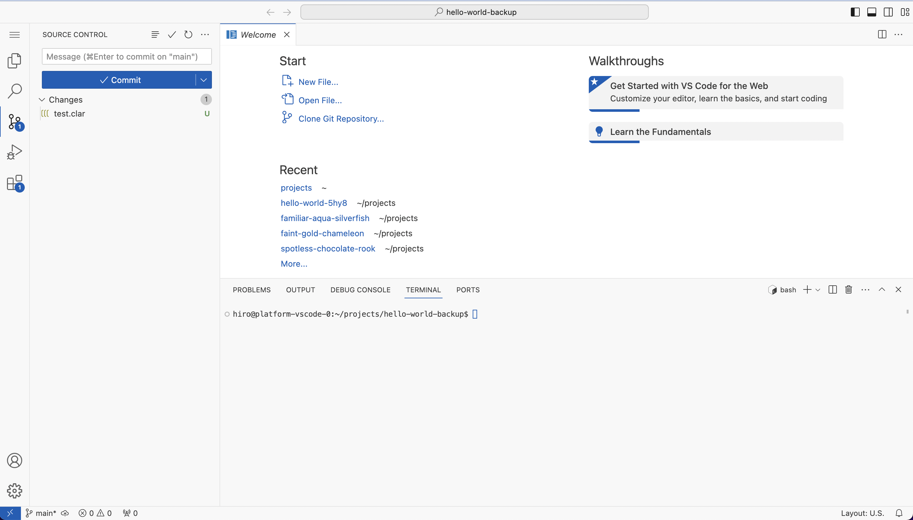
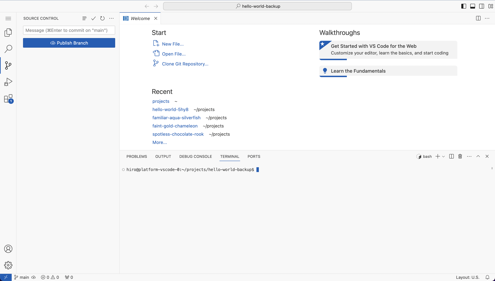
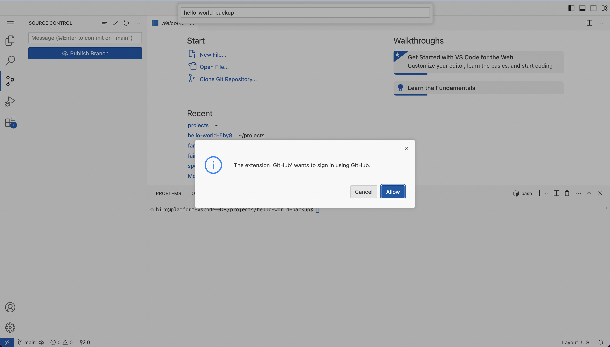

## Migrate a project to GitHub

If you have legacy projects in the Hiro Platform that you want to migrate to GitHub, you can follow these steps to move your project while maintaining its version history.

1. Sign in to the [Hiro Platform](https://platform.hiro.so/). Once you are authenticated, you will be redirected to the project page.
2. From your list of projects, find the project you wish to migrate.
3. Click on the top right dropdown to open the web editor. 
4. Select the Source Control Menu on the right and click 'Initialize Repository'. 
5. Open the terminal and configure your GitHub user information. Make sure to use the email associated with your GitHub account: 
    ```terminal
    $ git config user.email your@email.com
    $ git config user.name username
    ```
6. Commit your changes using the Source Control menu. 
7. Publish the branch to GitHub. 
8. You will be prompted to sign in with GitHub. Follow the authentication process to complete pushing your project to your GitHub account. 

<Callout title="Note" type="info">
  Make sure you have the necessary permissions and access to the GitHub repository where you want to migrate your project.
</Callout>
