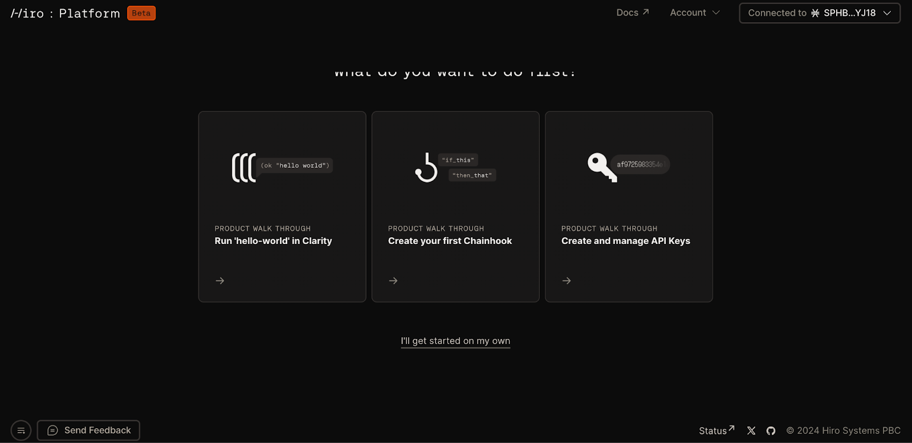
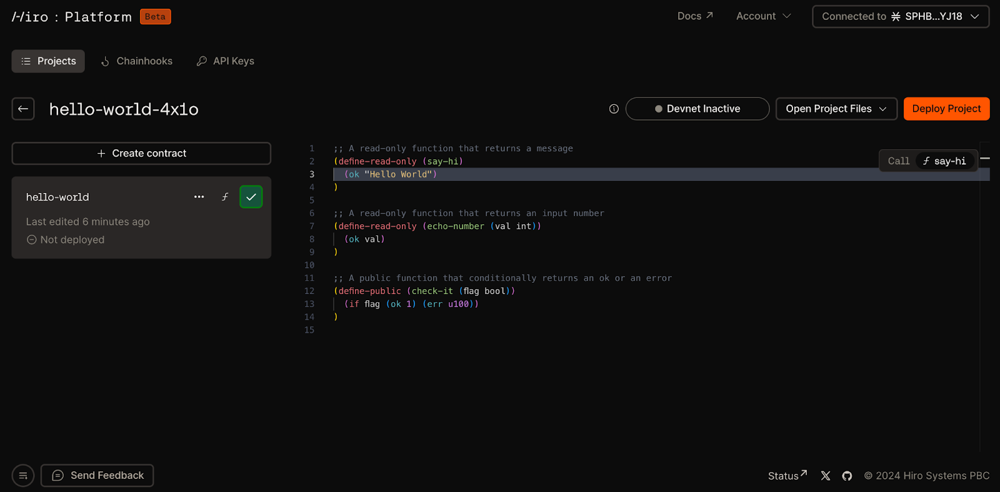
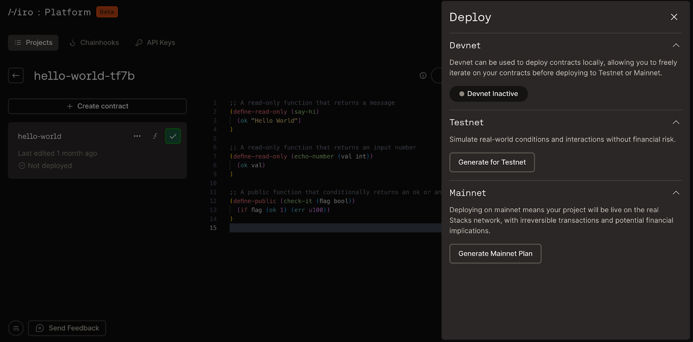
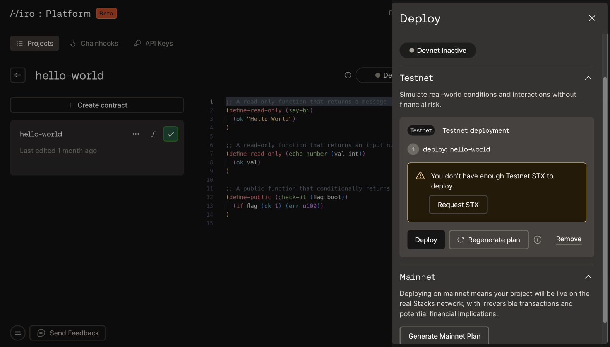

import { Code, Terminal } from 'lucide-react';
import { SmallCard } from '@/components/card';

In this quickstart guide, you will create a simple `hello-world` contract in the [Hiro Platform](https://platform.hiro.so/). You’ll learn how to create a new project, create a new contract, and deploy that contract to testnet on Stacks.

## Create your account

Start by creating an account in the Hiro Platform. You can create an account with:

- Email
- Google
- GitHub
- Discord

Once signed in, you will see an onboarding screen showing what the Hiro Platform has to offer:

## Create your smart contract

Click the “Run `hello-world` in Clarity” tile. This will generate a brand new project in the Hiro Platform, along with a `hello-world` contract.

From here, you can edit the contract directly in this code preview or edit the contract in VS Code on the web or on your local device via the “Open Project Files” dropdown.

Learn more about [smart contract development in the Hiro Platform](/stacks/platform/guides/build-contracts).

## Deploy your contract

For now, click the “Deploy Project” button to deploy your project to a network. This will open a menu where you can choose to deploy to devnet, testnet, or mainnet. The Hiro Platform will automatically generate a deployment plan for your project that will handle any contract dependencies in your project.

For this quickstart, let’s deploy to testnet. In order to deploy, you will need testnet STX, which you can request from a testnet faucet in the Hiro Platform.

Once your wallet receives the testnet tokens, you can deploy your contract. Congratulations, you’re now a Stacks developer!

### Next steps

<Cards className='sm:grid-cols-1'>
  <SmallCard
    icon={<Code className='text-primary' />}
    href="/stacks/platform/guides/devnet"
    title="Running Devnet"
    description="Learn how to use devnet, a private blockchain environment, to test your code."
  />
  <SmallCard
    icon={<Terminal className='text-primary' />}
    href="/stacks/platform/guides/create-chainhooks"
    title="Create and manage Chainhooks"
    description="Learn how to create custom event streams for Stacks or Bitcoin with Chainhook on the Platform."
  />
</Cards>