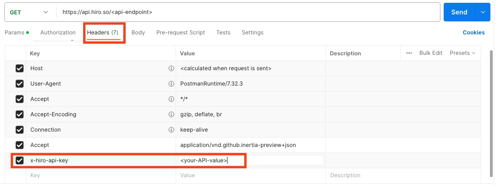

# How to use API Key?

API keys are alpha-numeric codes that identify and authenticate an application or developer. You can use API keys to control access to your API calls.

# Steps to use API Key

This guide helps you with the steps to use the API key to interact with the API.

> **_NOTE:_**
> The API key is passed in the **header** of your API call and is used only for private use, like server-side applications. This key is not to be exposed or shared.

Choose one of the following ways to interact with the API endpoints by passing the API key in the header.

- cURL
- Postman
- Typescript function

## Using cURL

Using cURL, you will pass the API key in an `x-hiro-api-key` header. Use the following command as an example to call the API endpoint `https://api.hiro.so/<your-api-endpoint>`.

`curl https://api.hiro.so/... -H 'x-hiro-api-key: <your-API-value>'`

## Using Postman

The following section walks you through using an API key with [Postman](https://www.postman.com/).

In Postman's request for the API, you can include the API key value received from the Hiro team in the **Headers** section, as shown in the image below.



## Using the API key in Typescript

You can use the following sample to pass the API key in your function using Typescript.

```typescript
function <your-api-function>(apiKey: string) {
  const url = `https://api.hiro.so/<your-api-endpoint>`;
  const headers = new Headers();
  headers.append("x-hiro-api-key", ${apiKey});

  return fetch(url, {
    headers: headers
  })
    .then(response => response.json());
}
```
