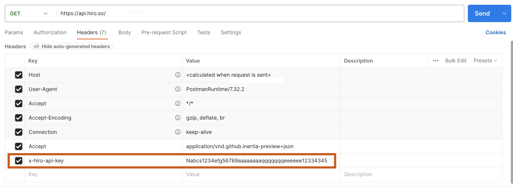

# How to use API Key

API keys are alpha-numeric codes that identify and authenticate an application or developer.

# Steps to use API Key

This guide helps you with the steps to use the API key to interact with the API.

> **_NOTE:_**
> The API key is passed in the **header** of your API call and is used only for private use, like server-side applications. This key is not to be exposed or shared.

There are multiple ways to interact with the API endpoints. This document walks you through three ways to make an API. You can choose between any of the following methods:

- cURL
- Postman
- Typescript function

## Using cURL

Using cURL, you will pass the API key in an `x-hiro-api-key` header. Use the following command as an example to call the API endpoint `https://api.hiro.so/...`.

`curl https://api.hiro.so/... -H 'x-hiro-api-key: Nabcs1234efg56789aaaaaaaaqqqqqqqeeeeee12334345'`

## Using Postman

The following section walks you through using an API key with [Postman](https://www.postman.com/).

In the Postman request for the API include the API key and its value received from the Hiro team in the **Headers** section, as shown in the image below.



## Using the API key in Typescript

```typescript
function getRecentMicroblocks(apiKey: string) {
  const url = `https://api.hiro.so/..`;
  const headers = new Headers();
  headers.append("x-hiro-api-key", ${apiKey});

  return fetch(url, {
    headers: headers
  })
    .then(response => response.json());
}
```
