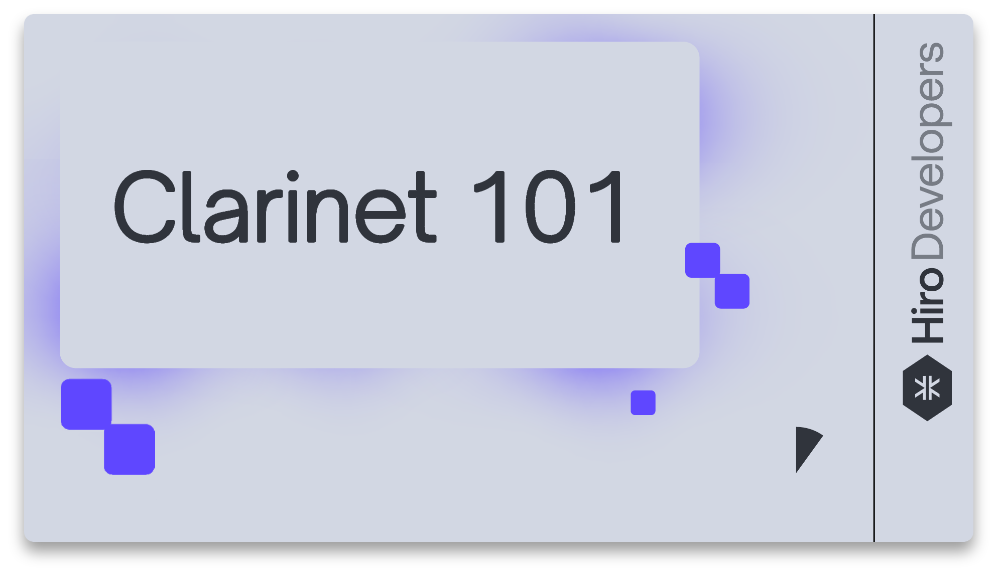

---
# The default id is the same as the one being defined below. so not needed
title: What is Clarinet?
---

## What is Clarinet?

Clarinet is a Clarity runtime packaged as a command line tool, designed to facilitate smart contract understanding, development, testing and deployment. Clarinet consists of a Clarity REPL and a testing harness, which, when used together allow you to rapidly develop and test a Clarity smart contract, with the need to deploy the contract to a local devnet or testnet.

To better understand Clarinet and how to develop with Clarinet, Hiro has created an introductory video tutorial series, from Hiro Engineer [Ludo Galabru](https://twitter.com/ludovic?lang=en), that will guide you through some of the basics and fundamentals of using Clarinet. The video also includes how you can use Clarinet to develop, test, and deploy smart contracts.

To view these video tutorials, please see [Hiro's Youtube channel](https://www.youtube.com/c/HiroSystems).
 

For more latest information on Clarinet product, refer to [blog posts on Clarinet](https://www.hiro.so/search?query=Clarinet).
