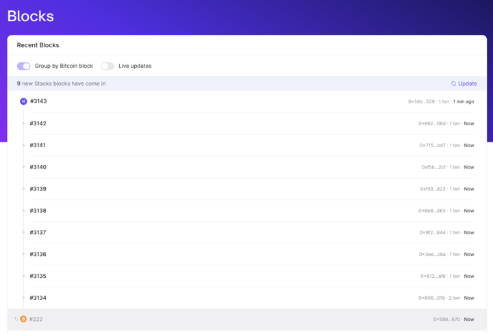
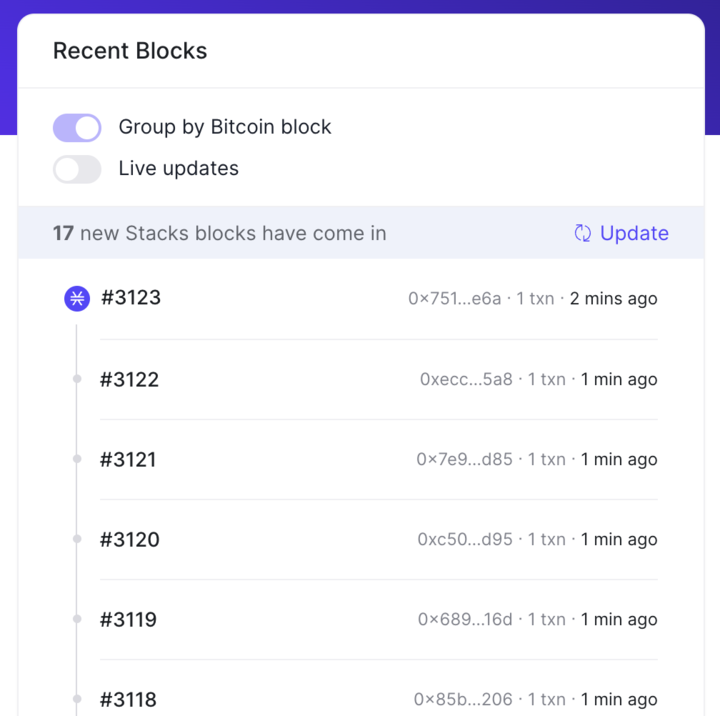

# Nakamoto Updates

## Stacks Explorer: What's New

### Introducing a Fresh View for Blocks

The Stacks Explorer now features a new way to display blocks, aligning with the Nakamoto upgrade's approach of multiple STX blocks settling into one BTC block.

### Tailored Viewing Experience

This new view is available on [Nakamoto Testnet](https://explorer.hiro.so/?chain=testnet&api=https://api.nakamoto.testnet.hiro.so/), accessible via the Network dropdown.

#### Two Distinctive Display Modes

1. **Independent Display:** Focuses on STX blocks progress.
2. **COMING SOON: Grouped by Bitcoin Block:** Shows BTC blocks flow alongside STX blocks.

### Stay in the Loop with Live View

Keep up-to-date with blocks in real-time with our new live view option.

---

## Stacks.js: What’s New

### StackingClient

Install the latest nakamoto version with `npm install @stacks/stacking@6.13.0`.

The StackingClient in `@stacks/stacking` was updated to match the latest pox-4 contract.

- Added `StackingClient.signPoxSignature()`
- Added `Pox4SignatureTopic` enum
- New stacking arguments for `StackingClient.stack`, `StackingClient.stackExtend`, `StackingClient.stackIncrease`, `StackingClient.stackAggregationCommit`, and `StackingClient.stackAggregationCommitIndexed`

[Learn more about the new Stacks.js updates](/nakamoto/stacks-js)

---

## Clarinet: What’s New

### `clarinet devnet start` Changes

See [Nakamoto Preview 1](https://github.com/hirosystems/clarinet/releases/tag/nakamoto-preview-1) and [Clarinet PR-1350](https://github.com/hirosystems/clarinet/pull/1350) for relevant notes + PRs.

- Clarinet’s devnet can now be used to test Nakamoto functionality. To enable this, add the `use_nakamoto = true` flag to your `Devnet.toml`.
- Enabling this feature will require accurate pox stacking orders. (See the release notes above for details)
- The devnet now starts an additional process - the Stacks Signer. (Details on how to configure the signer address coming soon)

### `clarinet check` Changes

- Running clarinet check --enable-clarity-wasm now runs the current interpreter and  clarity wasm  side-by-side to allow comparing outputs.

### `clarinet console` Changes

- clarinet console now automatically runs the current interpreter and clarity wasm side-by-side and logs any difference in outputs.

---

## Stacks Blockchain API: What’s New

### New Testnet URL

`https://api.nakamoto.testnet.hiro.so/`

### Nakamoto endpoints

The Stacks Blockchain API has a series of new endpoints to support the upcoming Nakamoto upgrade:

-  Get Proof-of-Transfer details per Cycle including Signers and Stackers, with information about stacked STX amounts, payout addresses and signer weights
-  Get a list of Stacks blocks per Bitcoin block to support the new Nakamoto mining mechanism
-  Get all transactions relevant to a STX address or Contract ID including filters for FT and NFT transfers
-  Support for the new Nakamoto `tenure_change` transaction type across all our transaction endpoints
-  Get a summary of current network mempool transaction fees, including statistics for expected confirmation priorities
-  Get the deployment status of multiple smart contracts in one call

All of these endpoints are backwards compatible with Stacks nodes running version 2.4 or earlier

### Event Replay optimizations

-  Optimize replay speed by creating a new parquet-based ingestion that optimizes for canonical chain information
-  Optimize classic TSV event replay by improving block ingestion times

### New transaction type `tenure_change`

Affects endpoints:

-  `/extended/v1/address/{principal}/transactions`
-  `/extended/v1/tx`
-  `/extended/v1/tx/{tx_id}`
-  `/extended/v1/tx/{tx_id}/raw`
-  `/extended/v1/tx/mempool`
-  `/extended/v1/tx/multiple`

### New endpoints: `/extended/v2/*`

-  `/extended/v2/mempool/fees`
-  `/extended/v2/burn-blocks`
-  `/extended/v2/burn-blocks/{height_or_hash}`
-  `/extended/v2/burn-blocks/{height_or_hash}/blocks`
-  `/extended/v2/blocks`
-  `/extended/v2/blocks/{height_or_hash}`
-  `/extended/v2/blocks/{height_or_hash}/transactions`
-  `/extended/v2/addresses/{address}/transactions:`
-  `/extended/v2/addresses/{address}/transactions/{tx_id}/events:`
-  `/extended/v2/smart-contracts/status`
-  `/extended/v2/pox/cycles`
-  `/extended/v2/pox/cycles/{cycle_number}`
-  `/extended/v2/pox/cycles/{cycle_number}/signers`
-  `/extended/v2/pox/cycles/{cycle_number}/signers/{signer_key}`
-  `/extended/v2/pox/cycles/{cycle_number}/signers/{signer_key}/stackers`

### Deprecated endpoints

-  `/extended/v1/block`
-  `/extended/v1/block/{hash}`
-  `/extended/v1/block/by_height/{height}`
-  `/extended/v1/block/by_burn_block_hash/{burn_block_hash}`
-  `/extended/v1/block/by_burn_block_height/{burn_block_height}`
-  `/extended/v1/address/{principal}/transactions`
-  `/extended/v1/address/{principal}/{tx_id}/with_transfers`
-  `/extended/v1/address/{principal}/transactions_with_transfers`
-  `/extended/v1/fee_rate`
-  `/extended/v1/tx/block/{block_hash}`
-  `/extended/v1/tx/block_height/{height}`

View the [API Reference](/nakamoto-api) here.
