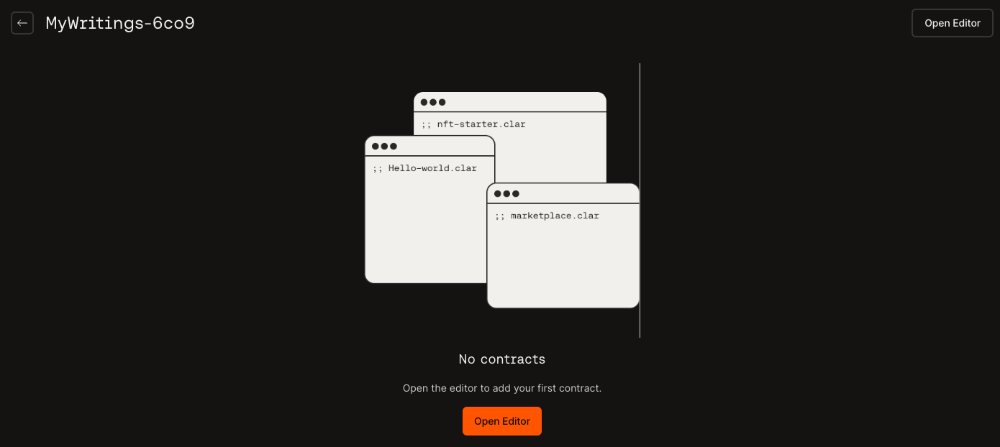

This article helps you create/build contracts using the [Hiro Platform](https://platform.hiro.so/).

## Prerequisites

- Log in using any of the methods described in the [Getting started](getting-started.md) guide.
- You have created or imported a project by following the steps in the [create project](create-project.md) guide.

## Build contract

:::tip

If you are new to Clarity programming, please try [Clarity Camp](https://learn.stacks.org/course/clarity-camp).

:::

If you have imported a project with no clarity contracts, you will see a window to open editor, as shown below.



You can now create contracts using any of the following ways.

1. Write new contracts
2. Add a contract to the project

### Write new contracts

You can create a new contract for your project by following the steps below. Note that the sample project used here is [clarity examples project](https://github.com/hirosystems/clarity-examples/tree/main/examples/blank-project), and it is assumed that your project has no clarity contracts.

1. On the [projects page](https://platform.hiro.so/projects), select the project you want to create a contract. 
2. Then, select the *Open Editor* button. 
3. This opens up a new tab with VS Code editor to edit your project. 
4. Inside VS Code, you can see the project directories and files.
5. Expand *examples* and see a directory *contracts* but no contracts are in this folder.
6. Right-click by selecting the *contracts* folder, select *New file* and add a new contract with a name of your choice. Eg: *clarity_contract_1.clar*
    
7. This will create a `.clar` file in the *contracts* folder. Now you can use the [clarity examples](https://github.com/hirosystems/clarity-examples) to customize your contract.
8. Once you are ready with your `.clar` file, you can update the `Clarinet.toml` file located in the same project directory. Use the following code to update the `.toml` file with these parameters. `[contracts.<your-contract-name>]` and path to use your `.clar` file name as `path = "<your-contract-name.clar>"`.

    ```
    [project]
    name = "CLARITY-EXAMPLES-5XE7"
    requirements = []
    [contracts.clarity_contract_1]
    path = "clarity_contract_1.clar"
    clarity_version = 1
    epoch = "2.05"
    ```
Save the file. You can now deploy your contracts in your project by referring to the [deploy project](deploy-project.md) guide.

## Add a new contract

When you are on the [projects](https://platform.hiro.so/projects) page with a list of projects, select a project with at least one contract. Select the *Open Editor* button to open your project in the VS Code editor.

You can now add a new contract by following **1-7** steps in the [write new contracts](#write-new-contracts) section mentioned above in this article.

In the 8th step, where you edit the `Clarinet.toml` file, you will add two lines of code, as shown below. Note that the below code assumes that the newly added contract is *clarity_contract_2*. Also, add the path to your new contract as shown below.

    ```
    [project]
    name = "CLARITY-EXAMPLES-5XE7"
    requirements = []
    [contracts.clarity_contract_1.clar]
    [contracts.clarity_contract_2.clar]  --> new
    path = "clarity_contract_1.clar"
    path = "clarity_contract_2.clar"  --> new
    clarity_version = 1
    epoch = "2.05"
    ```

### Test contract

You can customize your contracts, test, and debug them using the VS Code terminal inside the Hiro Platform. On your projects page, select the *Open editor* button to open up the VS Code editor. Select the three horizontal lines icon to open a new terminal. Refer to the following documents to test your contracts in the VS Code terminal.

- [Check contracts](https://docs.hiro.so/clarinet/how-to-guides/how-to-check-contract)
- [Test contracts](https://docs.hiro.so/clarinet/how-to-guides/how-to-test-contract)
- [Debug contracts](https://docs.hiro.so/clarinet/how-to-guides/how-to-debug-contract)

:::note

The **clarinet integrate** and **deployment plans** are currently not supported in Clarinet installed inside VS Code editor of the Hiro Platform.

:::

Once you are done adding, customizing, and testing the contracts, save your files. The Hiro platform is now ready to deploy your saved contracts.
