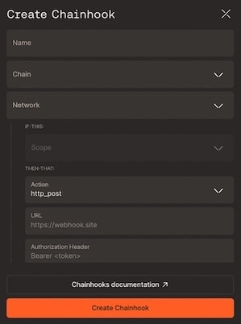
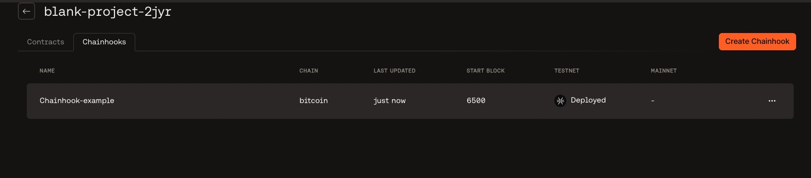
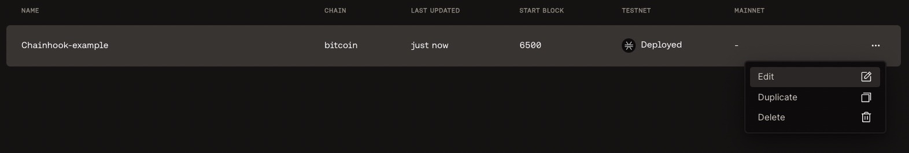
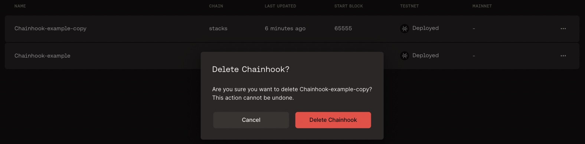

# Create Chainhook

With chainhooks, you can automatically trigger an action  in response to on-chain events on Stacks, Bitcoin, and other Bitcoin layers, enabling you to use IFTT (if_this, then_that) logic to power your applications. To learn more about Chainhook, refer to [Chainhook overview documentation](https://docs.hiro.so/chainhook/overview).

This guide helps you create a chainhook using the [Hiro Platform](https://platform.hiro.so/).

Login to the [Hiro Platform](getting-started.md) and create or import a project by following [this](https://docs.hiro.so/platform/create-project) guide. Next, you can follow the steps below to create a chainhook.

Once you are on the [Projects page](https://platform.hiro.so), select the project to create a chainhook.

You'll see a navigation bar with two tabs, Contracts, and Chainhooks. Select _Chainhooks_ to create a new chainhook.

Select the _Create chainhook_ button at the bottom of the screen.

A new pane opens up on the right to create a chainhook. Use the following fields to create a chainhook:

**Name**: Define a chainhook name of your choice.

**Chain**: Select between Bitcoin and Stacks to create a chainhook.

**Network**: Choose a network between `mainnet` and `testnet` to observe for events 

**If-this**: Based on the selected chain, you will see a list of available scopes for the `If-this` condition.

- For *Bitcoin*, the available predicate options are `txid`,`outputs`, `stacks_protocols`.

- For *Stacks*, the available predicate options are `txid`, `block_height`, `fungible_token_event`,
`non-fungible_token_event`, `stx_event`, `print_event`, `contract_deployment`.

> _**Note**_
>
> _Refer to the [Bitcoin predicates](https://docs.hiro.so/chainhook/how-to-guides/how-to-use-chainhook-with-bitcoin) and [Stacks predicates](https://docs.hiro.so/chainhook/how-to-guides/how-to-use-chainhook-with-stacks) documents to understand the available predicates and how to use them._
>

**Then-that**: This action is defaulted to `http_post` to allow the chainhook post events to the URL specified in the below option.

**URL**: Specify a URL to post chainhook events using the HTTP_post method.

**Authorization Header**: This field is optional to add a Secret to the `authorization` header when posting payloads.

**Start Block**: This field must specify the start block to search the chain.

**End Block**: It is optional to specify the end block. However, to optimize your scan time, it is recommended to specify this field.

**Expire After Occurrence**: You can specify a number greater than or equal to 1 to expire the chainhook after a specific number of occurrences. You can leave this blank if you don't want to set any limit.

**Decode Clarity Values**: This is enabled by default to help you decode clarity values in your contract.

Once you define the fields, you can select **Create a Chainhook**.

The right pane navigates to the Projects page with the Chainhooks tab open, and you can view the chainhook created.

The `NAME`, `CHAIN`, `LAST UPDATED`, `START BLOCK`, `TESTNET`, and `MAINNET` headers are updated based on the selected fields used to create a chainhook.

Based on the chosen network, the respective status columns in the Chainhook list page will be updated to **Deployed**.

Note that there may be other fields in the UI to create a chainhook based on the predicates defined.

## Edit Chainhook

Once the chainhook is created, you can edit the chainhook by using the ellipse on the created chainhook row.

You can update the fields and select **Update chainhook**.

## Duplicate Chainhook

Use the ellipse on the chainhook row to duplicate the chainhook created earlier.

This opens a right pane with all the fields populated to use to create a duplicate chainhook.

You can update the fields or directly select **Create chainhook** to duplicate a copy of the chainhook.

## Delete Chainhook

Use the ellipse on the chainhook row to delete the chainhook. You will see a confirmation window to confirm if you want to delete the chainhook.

## References

- [Use Chainhook with Bitcoin](https://docs.hiro.so/chainhook/how-to-guides/how-to-use-chainhook-with-bitcoin)
- [Use Chainhook with Stacks](https://docs.hiro.so/chainhook/how-to-guides/how-to-use-chainhook-with-stacks)
- [Run chainhook as a service using Bitcoind](https://docs.hiro.so/chainhook/how-to-guides/how-to-run-chainhook-as-a-service-using-bitcoind)
- [Run chainhook as a service using Stacks](https://docs.hiro.so/chainhook/how-to-guides/how-to-run-chainhook-as-a-service-using-stacks)
