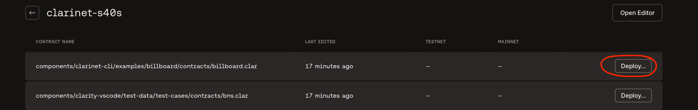
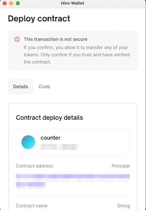
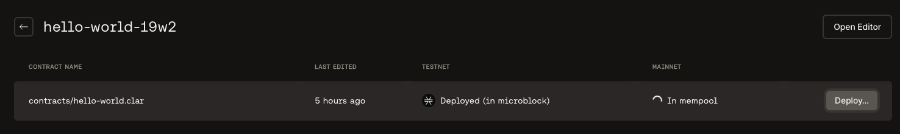
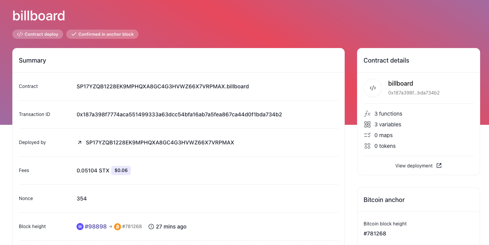

The [Hiro Platform](https://platform.hiro.so/) comes pre-configured with the VS Code extension, Clarinet, and Git. The hosted development environment with pre-integrated wallet UX and the click to **deploy** to a network shortens the developer's journey to interact with the Stacks blockchain.

This guide walks you through the deployment process of your project. Once you have your clarity contracts ready for your project, you can deploy the project easily using the Hiro Platform.

## Prerequisites

- Follow the [getting started](getting-started.md) guide to sign in to the Hiro Platform to easily interact with the Stacks blockchain.
- Follow the [create project](create-project.md) guide to create or import a project.
- Make sure you have [installed and connected to your wallet](https://wallet.hiro.so/) to deploy your contracts.
- Follow the [build contract](build-contract.md) guide to create or customize your smart contracts before you can deploy them.

The Hiro Platform gives you the ability to deploy your smart contracts using one click - the *Deploy button*.

## Use the deploy button

Once you have your smart contracts ready, you can deploy them to mainnet/testnet environments using the **Deploy** button on the Hiro Platform.

You can choose to deploy the contracts to mainnet/testnet environments. Ideally, it is recommended to deploy the smart contracts to the testnet environment, verify the smart contracts using Explorer and then deploy them to the mainnet environment.

The following are the steps to deploy your contracts using the **Deploy** button.

1. On the [projects page](https://platform.hiro.so/projects), select the project you want to deploy to the blockchain.
2. Then, in the list of the contracts displayed for the project, select the contract you are ready to deploy.
3. Use the *Deploy* button available on the right side of the contract.
4. Choose the environment to deploy - *Deploy to Testnet* or *Deploy to Mainnet*.
   
5. Once you choose the environment, a pop-up window opens up connecting your wallet, scroll down and select *confirm* to deploy the contract to your chosen environment.
   
   
6. While the deployment is in progress, you will see the status as *In mempool* under the environment field for the contract.

   

7. Once the deployment is confirmed, you will see the status of the contract as *Deployed* under the chosen environment.

   

## Monitor your contract in Explorer

This section helps you with the steps to monitor your contract in the [Explorer](https://explorer.stacks.co/?chain=mainnet).

1. You can now use the Pop-out button *View explorer* beside the *deployed* status to monitor your contract in Explorer.

2. The  *view explorer* button opens up [Explorer](https://explorer.stacks.co/?chain=mainnet) to view the contract you just deployed in the mainnet/testnet environments.
 
3. You can check the summary of your contracts, contract details, etc., in Explorer.

If you find issues with your deployment process, you can refer to the [FAQ section](faq.md) or file an issue to our [GitHub repo](https://github.com/hirosystems/artemis/issues).
