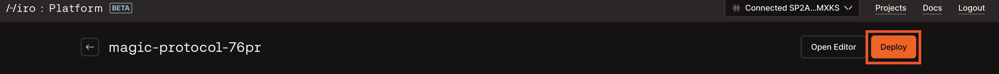
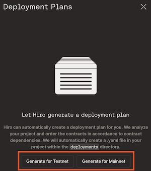
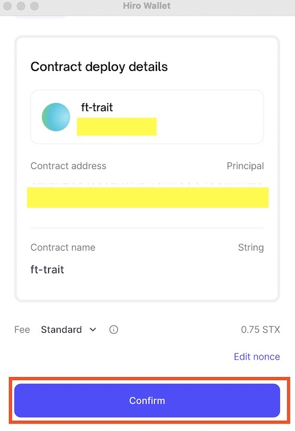
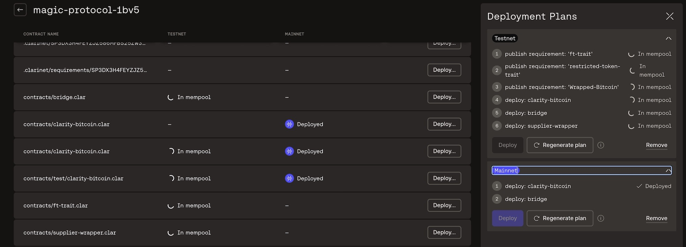
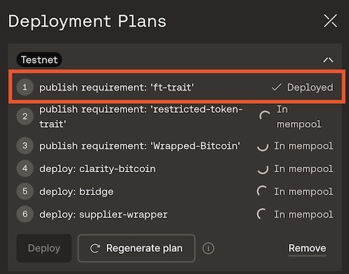
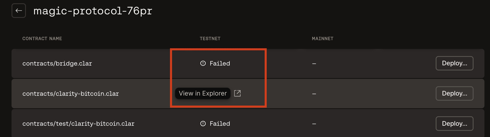
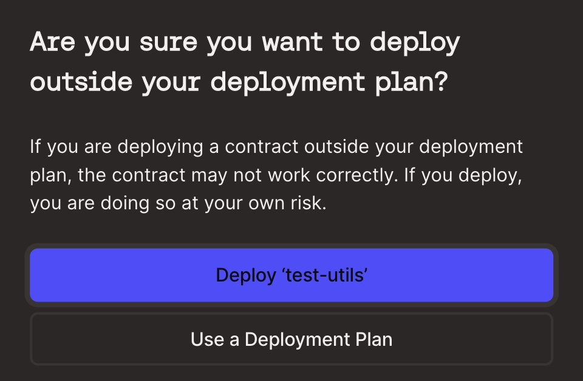

# Deployment Plans

Deployment plans are a collection of transactions to publish one or more contracts to a network (testnet or mainnet). This article walks you through deploying your contracts using deployment plans using [Hiro Platform](https://platform.hiro.so/).

To learn more about Deployment plans, refer to [customize deployment](https://docs.hiro.so/clarinet/how-to-guides/how-to-use-deployment-plans#deployment-plans) within the Clarinet docs.

## Generate Deployment Plan

This section helps you generate a deployment plan to deploy your contracts.

First, sign up to the [Hiro Platform](https://platform.hiro.so/) or login to the Platform if you are an existing user with your credentials. Refer to the [getting started](https://docs.hiro.so/platform/getting-started#sign-up-as-a-new-user) guide for guidance. Then, [create or import a project](https://docs.hiro.so/platform/getting-started#create-or-import-project) to use deployment plans.

To launch the deployment plans pane, select the **deploy** button on the top right corner of the page.

This brings up the deployment plans pane, where you can select the network to deploy the contracts using deployment plans. `Generate for Testnet` or `Generate for Mainnet.`

## Deploy

In this section, you will learn how to deploy your contracts using the generated deployment plans. This section walks you through generating deployment plans for testnet.

- Select `Generate for Testnet` to deploy your contracts to the Testnet.
- Next, select **deploy** to deploy your deployment plan with contracts to testnet.
- You will connect the wallet to the application and select `Confirm` to confirm the deployment. Note that each step in the deployment plan shows a prompt from the Hiro Wallet and requires you to confirm the transaction.

    

- Now, in your list of contracts, you will see the status of your deployment as `In mempool.`
  
  

    > **_NOTE:_**
    > The deployment process may take a while based on the blockchain traffic at the time of deployment.

- Upon successful deployment, the status changes to `Deployed.`

    

- The transaction may fail due to several reasons in the deployment process, then you will see the status as `Failed.` If you want to understand more details, you can view the transaction in [Explorer](https://explorer.hiro.so/) by selecting the pop-out arrow beside the contract.

    

### Deploy individual contract

If you choose to deploy an individual contract to either of the networks using the **Deploy** button, you will be prompted to confirm if you want to deploy outside of your deployment plan. Then, you can choose between deploying the contract vs. using a deployment plan. If you choose to deploy using a deployment plan, follow the steps described above in this article's [deploy](#deploy) section.

## Regenerate Plan

The **Regenerate plan** feature in the deployment plans is helpful when you have changes in your contracts and you wish to generate a new deployment plan.

### Add/update contracts

If you want to create or update a new contract, refer to this [guide](build-contract.md). You can also use the "Open Editor" button to open Visual Studio code to add a new contract.

> **_NOTE:_**
>
> If you add a new contract through Editor, ensure the new contract is configured to the `Clarinet.toml` file. For guidance, refer to [Clarinet.toml configuration for new contracts](https://docs.hiro.so/platform/build-contract#add-a-new-contract). You can also check your contracts before deploying them by following the [Check contract](https://docs.hiro.so/clarinet/how-to-guides/how-to-check-contract) guide.

You can then use the **Regenerate plan** button to update your deployment plan with your new or updated contract.

## Remove the deployment plan

Select the `Remove` button to remove the generated deployment plan.

## Additional Resources

- [Deployment Plans video walkthrough](https://www.youtube.com/watch?v=YcIg5VCO98s)
- [Debug contract](https://docs.hiro.so/clarinet/how-to-guides/how-to-debug-contract)
- [Test contract](https://docs.hiro.so/clarinet/how-to-guides/how-to-test-contract)
- [Customize deployment](https://docs.hiro.so/clarinet/how-to-guides/how-to-use-deployment-plans)
