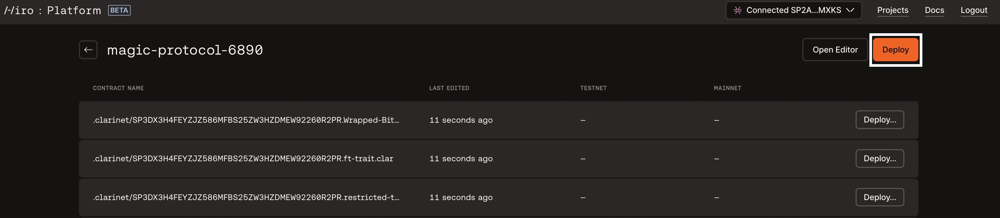
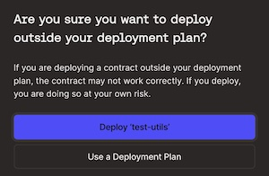

# Deployment Plans

Deployment plans are a collection of transactions to publish one or more contracts to a network (testnet or mainnet).
This article walks you through deploying your contracts using deployment plans in the [Hiro Platform](https://platform.hiro.so/).

To learn more about Deployment plans, refer to [Customize deployment](https://docs.hiro.so/clarinet/how-to-guides/how-to-use-deployment-plans#deployment-plans).

## Generate Deployment Plan

This section helps you generate a deployment plan to deploy your contracts.

First, sign up to the [Hiro Platform](https://platform.hiro.so/) or login to the Platform if you are an existing user with your credentials. Refer to the [getting started](https://docs.hiro.so/platform/getting-started#sign-up-as-a-new-user) guide for guidance.

Then, [create or import a project](https://docs.hiro.so/platform/getting-started#create-or-import-project) to use deployment plans.

To launch the deployment plans pane, select the **deploy** button on the top right corner of the page.

This brings up the deployment plans pane, where you can select the network to deploy the contracts using deployment plans. `Generate for Testnet` or `Generate for Mainnet.`

## Deploy

In this section, you will learn how to deploy your contracts using the created deployment plans.

- Select `Generate for Testnet` to deploy your contracts to the Testnet.
- Next, select **deploy** to deploy your deployment plan with contracts to testnet.

- You will connect the wallet to the application and select `Confirm` to confirm the deployment.

- Now, in your list of contracts, you will see the status of your deployment as `In mempool.`

- Upon successful deployment, the status changes to `Deployed.`
-  `Failed,` reflecting that there might be some error in the deployment process. You can view the transaction in [Explorer](https://explorer.hiro.so/) by selecting the pop-out arrow beside the contract.

If you choose to deploy a contract to either of the networks using the **Deploy** button beside each of the contracts, you will be prompted to confirm if you want to deploy outside of your deployment plan. Then, you can choose between deploying the contract vs. using a deployment plan.

## Regenerate Plan

Regenerate plan is helpful when you have changes in your contracts and you wish to create a new deployment plan.

Regenerate plans can be helpful when:

### New contract is added

If you want to create a new contract, refer to this [link](https://docs.hiro.so/clarinet/how-to-guides/how-to-add-contract). You can also use the "Open Editor" button to open Visual Studio code to add or update a contract.

:::note

If you add a new contract through Editor, ensure the new contract is configured to the `clarinet.toml` file.

:::

### Updated existing contract

If your existing contracts are updated, you can use regenerate your deployment plan to use the updated contract.
Once your contract is ready, you can [check your contract](https://docs.hiro.so/clarinet/how-to-guides/how-to-check-contract) and select `Regenerate Plan` to generate a new deployment plan.

## Remove the deployment plan

Select the `Remove` button to remove the generated deployment plan.

## Resources

- [Deployment Plans video walkthrough](https://www.youtube.com/watch?v=YcIg5VCO98s)
- [Debug contract](https://docs.hiro.so/clarinet/how-to-guides/how-to-debug-contract)
- [Test contract](https://docs.hiro.so/clarinet/how-to-guides/how-to-test-contract)
- [Customize deployment](https://docs.hiro.so/clarinet/how-to-guides/how-to-use-deployment-plans)
