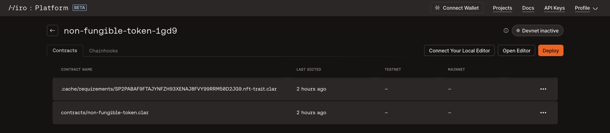
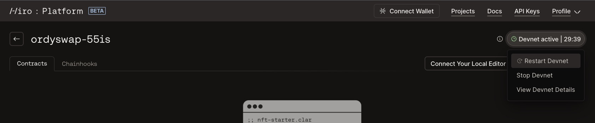
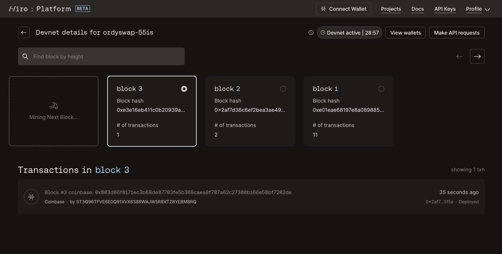
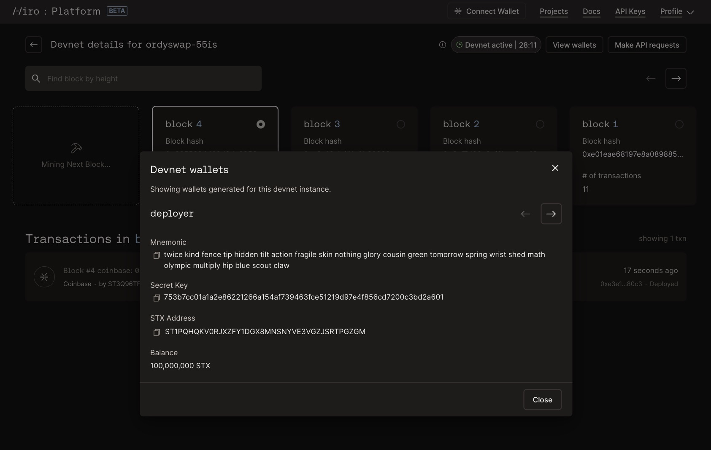
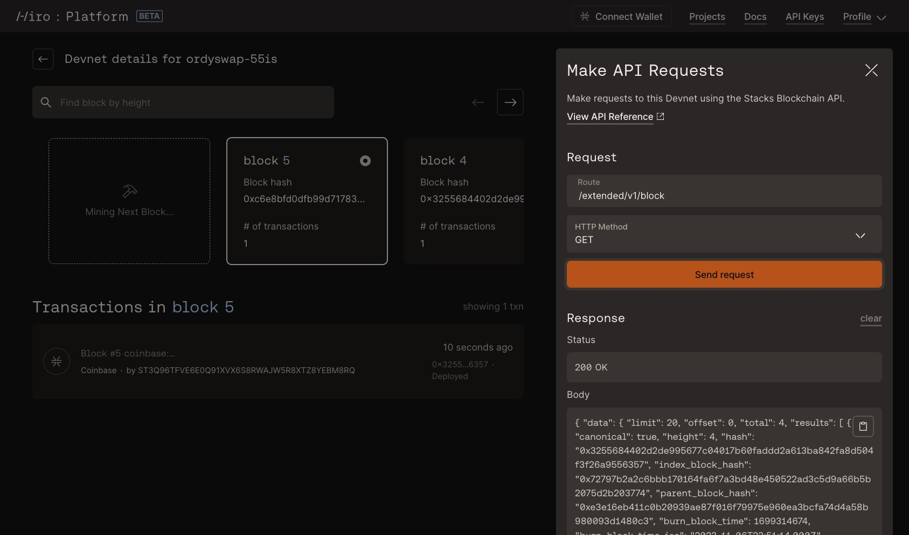

# Using Devnet on the Hiro Platform

Devnet on the Hiro Platform empowers developers with a private instance of the Stacks blockchain, enabling swift and secure smart contract testing. This guide will walk you through the process of using Devnet to expedite your development workflow.

## What is Devnet?

Devnet is a configurable, local blockchain simulation for the Stacks network, allowing developers to deploy and test smart contracts quickly. It provides a risk-free testing ground with the convenience of rapid prototyping, cost savings, and privacy.

## Benefits of Devnet

Devnet facilitates:

- **Rapid Prototyping**: Quick iterations with immediate feedback.
- **Cost-Efficiency**: No real cryptocurrency expenses for testing.
- **Customizable Testing Environment**: Tailor your blockchain parameters as needed.
- **Isolated Development**: A sandbox for confidential and secure testing.

## Using Devnet on Hiro Platform

### Getting Started

First, log into the [Hiro Platform](https://platform.hiro.so/). You can start a new project or import an existing. After setting up your project, navigate to the project page where you'll manage your Devnet.

### Starting and Managing Devnet

In the top right corner of your project's page, you'll notice a Devnet status indicator. Initially, it should read 'Inactive'. Click on this indicator to reveal a dropdown menu. From here, select 'Start Devnet' to initiate your private blockchain instance. If you want to configure your devnet like you can locally using `clarinet integrate` in the terminal, before you start devnet, open your project's `devnet.toml` file in the platform VSC editor and configure the settings to match your development needs.

### Initialization and Customization

Once you've started Devnet, it will take a few minutes to spin up. The status indicator on the platform will keep you updated on the progress.

### Active Development Session

When Devnet is ready, the status will change to 'Active', and a 30-minute session countdown will begin. This timer manages how long a devnet session will last. Once the 30 minutes are up the devent instance will automatically be shutdown.

### Exploring the Devnet Dashboard

With Devnet active, clicking on the status pill again will present the option to 'View Devnet Details'. Selecting this takes you to the Devnet dashboard, where you can interact with a block explorer and an "assembly line" of mined blocks.Transactions within each block are accessible here, and a search function is available for efficient block navigation.

### Additional Devnet Features

On the dashboard, you'll also find the 'View Wallets' option, which displays wallets generated for use within Devnet, and the 'Make API Requests' feature, allowing you to send requests to your Devnet's Stacks API instance and view responses directly within the platform.

### Future Enhancements

Looking ahead, direct access to Devnet resources will be provided, enabling API requests from external applications like a DApp frontend.

### Session Management and Limits

Be mindful of the 30-minute timer, as your Devnet will shut down when it expires. If needed, you can restart Devnet to refresh the timer. Keep in mind the monthly limit of 100 Devnet sessions to plan your development schedule accordingly.

## Final Notes

Remember, only one Devnet instance can run at a time per user account. If you need to work on a different project, simply start Devnet within that project to seamlessly transition.

## Conclusion

Devnet is an invaluable part of the Hiro Platform that streamlines the development process, ensuring you can focus on creating, testing, and refining your applications with efficiency and ease. We're excited to see what you build on the Stacks blockchain. Happy coding!

We wish you success as you embark on your development journey on the Hiro Platform!
