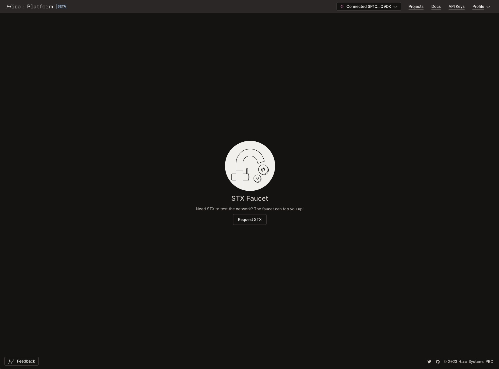

# Stacks Testnet Faucet

The Stacks Testnet Faucet is a dedicated utility for developers building on the Stacks blockchain. To aid you in deploying and running smart contracts on the Stacks testnet, we've provided this faucet that offers easy access to testnet STX tokens.

## Why Use the Stacks Testnet Faucet?

Building and testing on a blockchain requires a certain amount of native tokens to facilitate various operations, from contract deployments to transaction executions. However, sourcing these tokens can often be a cumbersome process. The Stacks Testnet Faucet simplifies this by offering a hassle-free way to acquire STX tokens for testing purposes.

## How to Request Testnet STX

1. **Visit the Faucet Page**: Navigate to [platform.hiro.so/faucet](https://platform.hiro.so/faucet).
2. **Login into Your Wallet**: Log into the platform with the wallet that has the test account that you want funded. Click _Connect Wallet_ to login.
3. **Request Tokens**: You'll find a straightforward interface with a button to request tokens. Simply click on the button _Request STX_.
4. **Receive 500 STX Tokens**: By clicking the button, you'll receive 500 STX tokens to your testnet account.

### Note:

- **Daily Limit**: To ensure fair distribution and availability for all developers, there's a limit of one request per day. Plan your testing accordingly!
