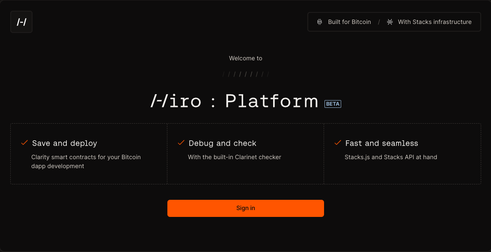
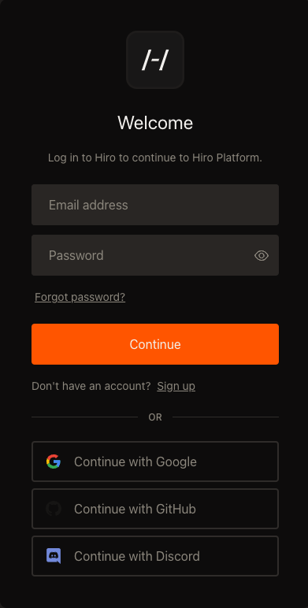
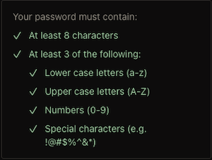
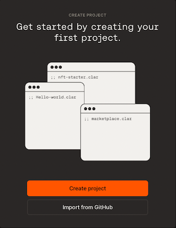
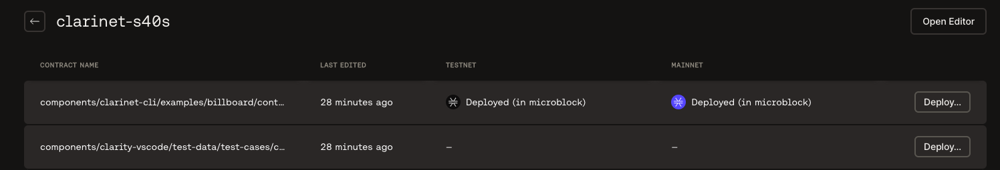
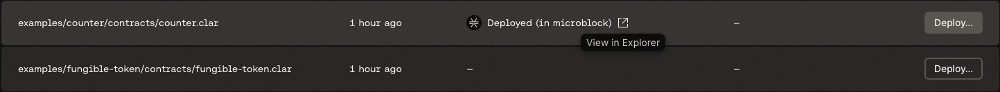
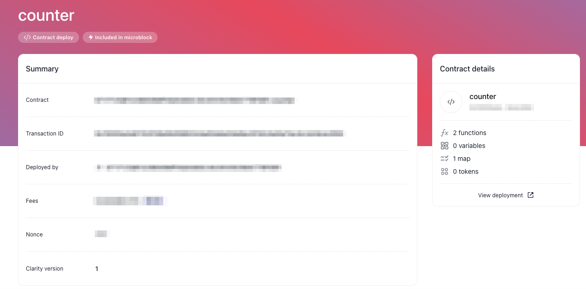

When you navigate to the [Hiro Platform](https://platform.hiro.so/), you will be prompted to log into the platform using your login credentials.

If you are a new user, you can sign up to create a new account or continue as an existing user to log in with the following options.

- Email
- Google
- GitHub
- Discord

### Sign up as a new user

To sign up as a new user, perform the steps described below.

1. Enter your email in the "Email address" field.
2. Enter your password in the "Password" field, meeting the password standards as shown in the image below.

### Sign in using your email/google/GitHub or discord

To sign into the Hiro platform using your email address, perform the steps described below.

1. Enter your email in the "Email" field.
2. Enter your password in the "Password" field.
3. Hiro will attempt to verify your credentials. If successful, you are taken to the [projects](https://platform.hiro.so/projects/) page.

Once you are signed in using any of the above methods, you can follow the create, build, deploy, and monitor sections to quickly deploy your smart contracts using the Hiro Platform.

## Create or import project

Now that you are signed in using one of the above methods, you can create or import a new project. You can do this by referring to [create project](create-project.md).

## Create and build contracts

Once you create or import a project, you can view the contracts in your projects and edit them using the VS Code editor available. You can further customize your projects or contracts.

## Deploy project

Once your Clarity contracts are ready to deploy, follow the [deploy project](deploy-project.md) guide to deploy your contracts to testnet or mainnet networks.

## Monitor contracts

To monitor the progress of your deployed contract, you can use the links to Explorer assigned to each contract and verify the submitted deployment transaction.

