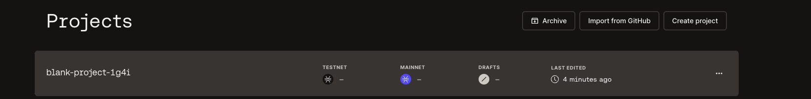
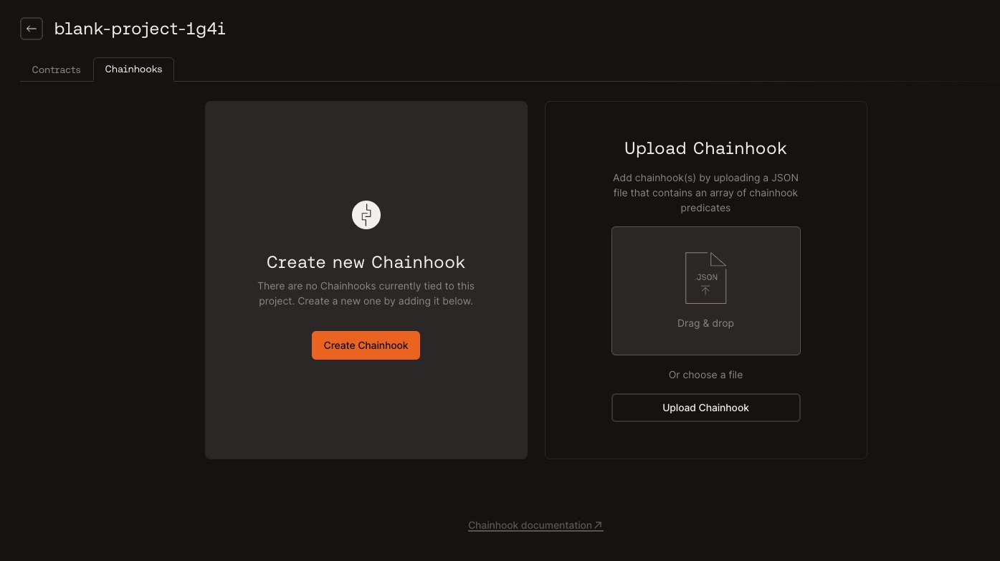

# Create Chainhooks

With Chainhook, you can automatically trigger an action in response to on-chain events on Stacks, Bitcoin, and other Bitcoin layers, enabling you to use IFTTT (if_this, then_that) logic to power your applications. To learn more about Chainhook, refer to [Chainhook overview documentation](../../chainhook/overview.md).

This guide helps you create a Chainhook using the [Hiro Platform](https://platform.hiro.so/).

Login to the [Hiro Platform](../getting-started.md) and create or import a project by following [this](../guides/create-project.md) guide. Next, you can follow the steps below to create a Chainhook.

Once you are on the [Projects page](https://platform.hiro.so), select the project to create a Chainhook.

You'll see a navigation bar with two tabs, Contracts, and Chainhooks. Select the _Chainhooks_ tab.

There are two ways to create a Chainhook. You can either create a Chainhook from scratch using our form, or you can upload a Chainhook(s) that you have already defined in JSON.

# Creating a Chainhook

Select the _Create Chainhook_ button.

A new pane opens up on the right to create a Chainhook. Use the following fields to create a Chainhook:

**Name**: Define a Chainhook name of your choice.

**Chain**: Select between Bitcoin and Stacks to create a Chainhook.

**Network**: Choose a network between `mainnet` and `testnet` to observe for events.

**If-this**: Based on the selected chain, you will see a list of available scopes for the `If-this` condition.

- For _Bitcoin_, the available predicate options are `txid`,`outputs`, `stacks_protocols`.

- For _Stacks_, the available predicate options are `txid`, `block_height`, `fungible_token_event`,
  `non-fungible_token_event`, `stx_event`, `print_event`, `contract_deployment`.

> _**Note**_
>
> _Refer to the [Bitcoin predicates](../../chainhook/guides/chainhooks-with-bitcoin.md) and [Stacks predicates](../../chainhook/guides/chainhooks-with-stacks.md) documents to understand the available predicates and how to use them._

**Then-that**: This action is defaulted to `http_post` to allow the chainhook to post events to the URL specified in the below option.

**URL**: Specify a URL to post Chainhook events to the HTTP_post method.

**Authorization Header**: This field is optional to add a Secret to the `authorization` header when posting payloads.

**Start Block**: This field must specify the start block to search the chain.

**End Block**: It is optional to specify the end block. However, to optimize your scan time, it is recommended to specify this field.

**Expire After Occurrence**: You can specify a number greater than or equal to 1 to expire the Chainhook after a specific number of occurrences. You can leave this blank if you don't want to set any limit.

**Decode Clarity Values**: This is enabled by default for stacks predicates to help you decode clarity values in your contract.

You'll see the following options for Bitcoin chain,

**Include Proof**: Enable this option when you have evidence that the transaction or block has been verified and authorized by the sender using their private key. This proof is generally a cryptographic signature to a transaction or block on the Bitcoin blockchain.

**Include Inputs**: Enable this option to include Bitcoin transaction inputs in the payload. In a Bitcoin transaction, inputs are references to previous transactions' outputs (also known as unspent transaction outputs or UTXOs) that are being spent in the current transaction. These inputs provide evidence that the sender has the right to spend the funds.

**Include Outputs**: Enable this option to include Bitcoin transaction outputs in the payload. Including outputs in a Bitcoin transaction refers to specifying the destinations and amounts of Bitcoin being sent as part of a transaction. Outputs in a Bitcoin transaction represent the recipients' addresses and the corresponding amounts of Bitcoin they are receiving.

**Include Witness**: Enable this option to include Bitcoin transaction witness in the payload. The witness data for a transaction includes the cryptographic signatures and other related information placed alongside the transaction data in the block.

Once you define the all the required fields, you can select **Create Chainhook**.

The right pane navigates to the Projects page with the Chainhooks tab open, and you can view the Chainhook created.

The `NAME`, `CHAIN`, `START BLOCK`, `NETWORK`, `STATUS`, and `LAST UPDATED` headers are updated based on the selected fields used to create a Chainhook.

Based on the chosen network, the respective status columns in the Chainhook list page will be updated to **Deployed**.

Note that there may be other fields in the UI to create a Chainhook based on the predicates defined.

# Uploading a Chainhook

To upload a chainhook, you can either select the _Upload Chainhook_ button and choose the .json file that has the Chainhook(s) you want to upload, or you can drag and drop the .json file into the file upload area.

The upload file must be a .json file containing either a single json object representing a Chainhook predicate, or an array of json objects representing one or more Chainhook predicates.

Refer to the [Bitcoin predicates](../../chainhook/guides/chainhooks-with-bitcoin.md) and [Stacks predicates](../../chainhook/guides/chainhooks-with-stacks.md) documents to understand the available predicates and how your Chainhook predicate json for upload.

## Edit Chainhook

Once the Chainhook is created, you can edit the Chainhook by using the ellipse on the created Chainhook row.

You can update the fields and select **Update chainhook**.

## Duplicate Chainhook

Use the ellipse on the Chainhook row to duplicate the Chainhook created earlier.

This opens a right pane with all the fields populated to use to create a duplicate Chainhook.

You can update the fields or directly select **Create Chainhook** to duplicate a copy of the Chainhook.

## Delete Chainhook

Use the ellipse on the Chainhook row to delete the Chainhook. You will see a confirmation window to confirm if you want to delete the Chainhook.

## Chainhook Status

The Chainhook row has a `STATUS` column that displays whether the Chainhook is in an Active, Inactive, or Error state. Active means the Chainhook is actively scanning blocks against the Chainhooks defined predicate, inactive means the Chainhook has reached a terminal state, e.g. its end block has been reached, and it is no longer scanning blocks, and error means the Chainhook ran into an error during its execution.

More status info can be found by hovering over the status element. For example, to understand why the Chainhook is in an error state, hover over the status element to find out!

## References

- [Use Chainhooks with Bitcoin](../../chainhook/guides/chainhooks-with-bitcoin.md)
- [Use Chainhooks with Stacks](../../chainhook/guides/chainhooks-with-stacks.md)
- [Run Chainhook as a service using Bitcoind](../../chainhook/guides/chainhook-as-a-service-bitcoind.md)
- [Run Chainhook as a service using Stacks](../../chainhook/guides/chainhook-as-a-service-stacks.md)
