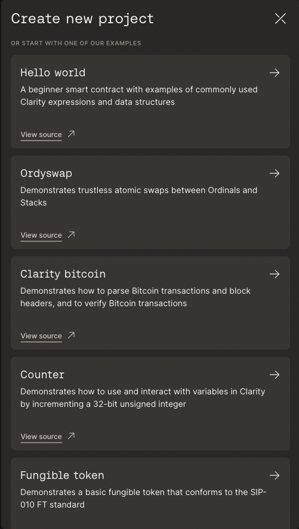
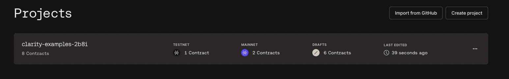
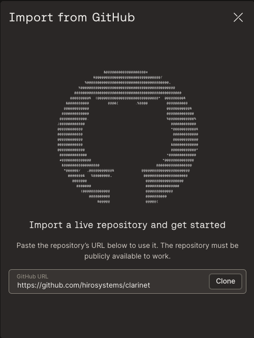
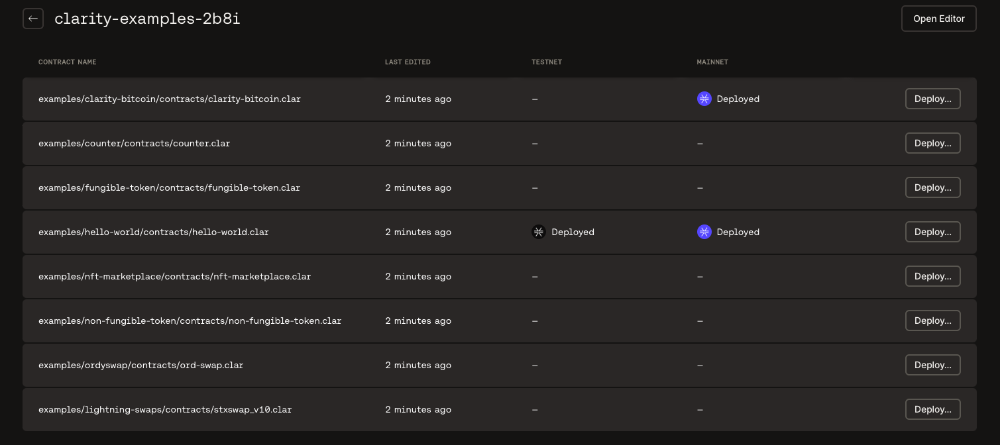

## Introduction

This document helps you create a new project or import a project from GitHub.

## Prerequisites

- Make sure you are logged into the Hiro Platform using any of the login methods explained in the [Getting started](../getting-started.md) document.
- You have accepted the *Terms and Conditions*.

After you are logged into the [Hiro Platform](https://platform.hiro.so/), you will be navigated to the projects page to allow you two options Create a project or import a project from GitHub.

An example workflow of the steps required to create a new project is described below.

## Create Project

On the [*projects page*](https://platform.hiro.so/projects), you can create a new project by selecting the *Create project* button.
To create a new project, you can start with a *Blank project* or use one of the examples displayed in the project modal - Hello world, Ordyswap, Clarity bitcoin, Counter, Fungible token, Lightning swaps, NFT marketplace, Non-fungible token.

Once you select a new project from the list, the selected project will be displayed on the [projects](https://platform.hiro.so/projects) page. The remaining of this section walks you through the *Hello world* project.

Select the project to see its contracts with a Contract name and an option to *Deploy* the contract.

## Import Project from GitHub

This section helps you import your project from GitHub.

You can use any project with clarity files `.clar` to import into the Hiro Platform and deploy the contracts to mainnet or testnet environments.

After your import, your project shows a list of .clar files, as shown below. 

Now that you have created or imported your projects, you can now deploy the contracts. Follow the [how to deploy contracts](how-to-deploy-contract.md) guide to walk you through the process.
