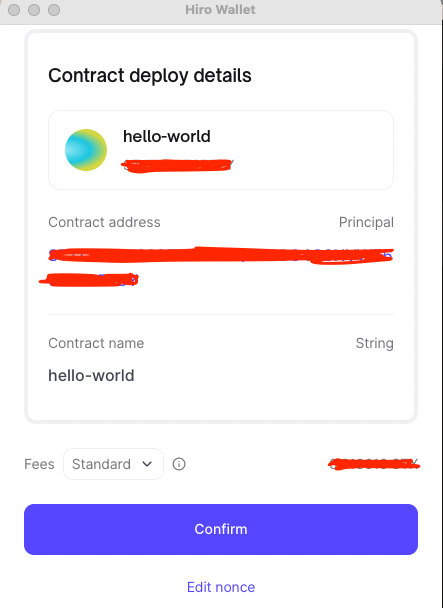
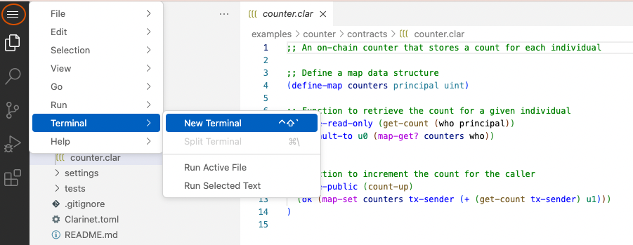

## Introduction

The Hiro Platform comes pre-configured with the VSCode extension, Clarinet, and Git. Having these tools already installed and configured shortens the time required to deploy a contract.

This guide walks you through the contract deployment process. 
Once you have your clarity contracts ready for your project, you can deploy them in less than 5 min to the blockchain.

## Prerequisites

- Follow the [getting started](../getting-started.md) guide to sign in to the Hiro Platform.
- Follow the [create project](how-to-create-project.md) guide to create or import a project.
- Make sure you have [installed and connected to your wallet](https://wallet.hiro.so/) to deploy your contracts.

Once you are ready to deploy your contracts, you can deploy them to devnet or testnet environments. It is ideal for testing your contracts in the testnet environment before deploying to the mainnet.

## Deploy contract

The process of deploying a contract includes deploying first to a testing environment (testnet) where the contract may be tested. After testing is complete, the contract may then be deployed to a live production environment (mainnet).

### Testnet deployment

The Stacks testnet provides a risk-free environment that imitates how a decentralized app (dapp) might function in a live production environment. Testing and debugging a contract in a non-production environment is a good best practice to ensure your contract operates the way you want it to before deploying it to the Stacks blockchain, where other developers can also use it.

Once you select the *confirm* button, your contract gets deployed to the testnet environment. 

After the successful deployment, you can select the pop-out arrow to view the contract in the [explorer](https://explorer.stacks.co/?chain=testnet). 

## Verify your contract in Editor

1. On your [projects page](https://platform.hiro.so/projects), select the contract you have deployed to testnet and then select the *Open Editor* button to view your project in the Visual studio code editor.

2. In VSCode, select the contract from the Contracts folder on the left navigation page and then open a new terminal window.

## Mainnet deployment

The mainnet environment is a live, production-ready environment that makes your contract visible and available to other developers on the Stacks blockchain. It is recommended that you test your contract in the testnet environment before deploying it to production.

Once your contract is verified and is ready to deploy to the mainnet, you can deploy using either of the following ways:

### Deploy using VS code terminal

1. In your VS code terminal, you can deploy your contract using the command: `clarinet deployment.` 

2. Once your contract is deployed to the mainnet, verify the contract was deployed successfully by checking if the contract is displayed in the Mainnet column on the Project page.

### Use the deploy button

1. You can use the *Deploy* button available for the contract.
2. On the pop-up window connecting your wallet, select *confirm* to deploy the contract to mainnet.
3. While the deployment is in progress, you will see the status *In mempool*.

Once the deployment is confirmed, you will see *Deployed* in the mainnet section.

