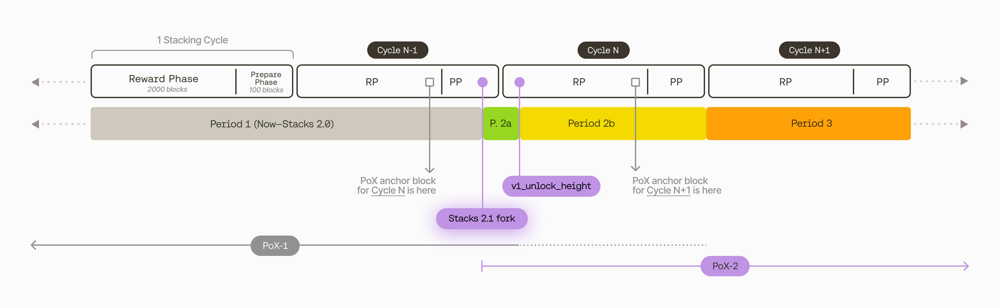

## Overview

In this article, you will learn about Stacks 2.1 to 2.4 migration and how the Hiro product changes reflect this upgrade.

## What is Stacks 2.4?

[Stacks 2.4](https://forum.stacks.org/t/stacks-2-4-is-here-stacking-to-be-re-enabled/15024) is a fork and protocol upgrade of the Stacks blockchain. Among [Stacks 2.4 upgrade and Testnet reorg](https://forum.stacks.org/t/stacks-2-4-and-testnet-reorg/15027), Stacks 2.4 includes an updated [Proof-of-Transfer](https://docs.stacks.co/docs/understand-stacks/proof-of-transfer) (PoX) [contract](https://docs.stacks.co/docs/clarity/noteworthy-contracts/stacking-contract) (often informally referred to as "PoX-4") for Stacking. Stacking allows users to lock up STX to support the network and earn BTC.

## What is PoX-4?

[Proof-of-transfer (PoX)](https://docs.stacks.co/docs/understand-stacks/proof-of-transfer) is a consensus mechanism in modern blockchains. In Stacks 2.05 or earlier versions, this consensus mechanism uses the `.pox` ([boot/pox.clar](https://explorer.stacks.co/txid/SP000000000000000000002Q6VF78.pox?chain=mainnet&_gl=1*6fljeg*_ga*MTY3NTgyOTg2OS4xNjY2MjA3NDM3*_ga_NB2VBT0KY2*MTY3MDk1ODcyNS4xMTEuMC4xNjcwOTU4NzI1LjAuMC4w), aka PoX-1) boot smart contract. With the Stacks 2.4 upgrade, the new fork is updated to `.pox-4` ([boot/pox-2.clar](https://github.com/stacks-network/stacks-blockchain/blob/next/src/chainstate/stacks/boot/pox-2.clar), aka PoX-2).

### PoX-2 periods

The PoX-2 fork evolves in the following periods. Hiro products adapt to these periods to align with the new [network upgrade — SIP-015](https://github.com/stacksgov/sips/blob/a17d318321abf0754e8b2ce5706a9d25493d42ee/sips/sip-015/sip-015-network-upgrade.md).

- **`Period 1`** — Stacks 2.0 and PoX-1 consensus rules in effect.
- **`Period 2`** — PoX-1 is still active. Stacking or delegating can start with PoX-2.
  - **`Period 2a`** — PoX-1 deactivates and PoX-2 is now active. Tokens locked in PoX-1 contract unlock.
  - **`Period 2b`** — In the 2.1 fork, after v1_unlock_height, but before the first PoX-2 reward cycle.
- **`Period 3`** — PoX-2 is active. The first PoX-2 reward cycle starts.

> **_NOTE:_**
>
> PoX-2 is not immediately used for reward cycles after the 2.1 fork. Period 2 (2a and 2b) allows stackers to stack and delegate their funds using PoX-2.

The currently "active" PoX contract will determine the reward set for the upcoming reward cycle. If PoX-1 is the "active" contract, the next reward cycle will read from the smart-contract state of PoX-1 to determine **who is paid out to** for Proof-of-Transfer consensus. The transition when PoX-2 is "active," but the current reward set is still being read from PoX-1 state is _Period 2b_.

To understand more about PoX-2 activation, reward cycles, and phases, refer to the below diagram.



Now that you have a general understanding of Stacks 2.1 and the PoX changes and what to expect, let's dive into each product and understand the new features or improvements to the existing features for Stacks 2.1 upgrade.

## Clarinet

This section explains the Stacks 2.1 upgrade for Clarinet.

### Contract settings

In your project's `Clarinet.toml` file, you can now specify the epoch during which a contract should be deployed, and the Clarity version it uses. Note that you may **only** select the Clarity version in epoch 2.1.

```toml
[contracts.cbtc-token]
path = "contracts/cbtc-token.clar"
clarity = 2
epoch = "2.4"
```

### Update Devnet settings

This section helps you update your Devnet settings to work with the Stacks 2.1 upgrade.

If you are new to Clarinet, refer to the [Getting started](https://github.com/hirosystems/clarinet/blob/main/docs/getting-started.md) guide to install clarinet, [set up local development environment](https://github.com/hirosystems/clarinet/blob/main/docs/how-to-guides/how-to-set-up-local-development-environment.md) and [create your project](https://github.com/hirosystems/clarinet/blob/main/docs/how-to-guides/how-to-create-new-project.md).

To upgrade your clarinet version, you can [install from a pre-built binary](https://github.com/hirosystems/clarinet/blob/main/docs/getting-started.md#install-from-a-pre-built-binary) or [install from source using Cargo](https://github.com/hirosystems/clarinet/blob/main/docs/getting-started.md#install-from-source-using-cargo).

After installing the latest version of Clarinet, navigate to your project directory and then to `settings/Devnet.toml` (hereafter referred to as **devnet.toml**).

Find the section [devnet] with the following settings.

```
[devnet]
disable_stacks_explorer = false
disable_stacks_api = false
...
```

Add a new setting, `enable_next_features = true,` and keep the remaining settings as-is.

The updated Devnet.toml looks like this:

```
[devnet]
enable_next_features = true
disable_stacks_explorer = false
disable_stacks_api = false
...
```

Spin up a local Devnet network using the command:

`$ clarinet integrate`

If you have any trouble with the above command, refer to the [troubleshooting guide](https://github.com/hirosystems/clarinet/blob/main/docs/troubleshooting.md) or report an issue [here](https://github.com/hirosystems/clarinet/issues).

New stacks-node will spin up. At Bitcoin block height 102, the chainstate will migrate to epoch 2.05, a network upgrade introduced earlier this year, reducing operations costs. At bitcoin block height 106, the chainstate will migrate to epoch 2.1.

As shown in the below screenshot, the epoch changes are indicated in the _Transactions_ section `deployed: ST00000000000000002AMW42H.costs-3 (ok true).`


> **NOTE**
>
> If the contracts you're developing use Clarity 2, you must wait for this epoch to cross before deploying your contracts.

These block heights can be customized using the settings in the devnet.toml:

```
[devnet]
...
epoch_2_05 = 102
epoch_2_1 = 106
```

> **_NOTE:_**
> If you have trouble or find issues, you can report them [here](https://github.com/hirosystems/clarinet/issues).

## Stacks Blockchain API

The following updates for the API endpoints are for the Stacks 2.1 upgrade.

### Distinguish contract versions

This section explains the new property returned with the following existing endpoints.

The endpoints `/extended/v1/tx/<txid>` and `/extended/v1/contract/<contract-id>` now return a new property, `clarity_version.`

The sample response with the new property is shown below:

```
{
  "tx_id": "0x33c573f5ed06f1feecaa4a9df0225e109416dbba9792abb0cd94869bbad4a88a",
  "canonical": true,
  "contract_id": "ST000000000000000000002AMW42H.pox-2",
  "block_height": 2,
  "clarity_version": 2, <-- New
  "source_code": ";; PoX testnet constants\n;; Min/max number of reward cycles uSTX can be locked for..."
}
```

A sample response for a regular (non-versioned) smart contract transaction with Clarity version null is shown below:

```
{
  "tx_id": "0x55bb3a37f9b2e8c58905c95099d5fc21aa47d073a918f3b30cc5abe4e3be44c6",
  "canonical": true,
  "contract_id": "ST000000000000000000002AMW42H.bns",
  "block_height": 1,
  "clarity_version": null, <-- New
  "source_code": ";;;; Errors\n(define-constant ERR_PANIC 0)..."
}
```

### Coinbase payouts

The Stacks 2.1 upgrade supports alternate recipients for Coinbase transactions. The `alt_recipient` value is passed in the blockchain transaction, and the API returns a new Coinbase `alt_recipient` property on applicable requests; if you want to use the latest methods detailed above, you need to update `@stacks/stacking` to version >=`6.0.0`.

The `alt_recipient` value varies based on the standard vs. contract principal recipients.

Standard principal recipient sample:
`"alt_recipient": "ST2X2FYCY01Y7YR2TGC2Y6661NFF3SMH0NGXPWTV5" <-- New`

Contract principal recipient sample:
`"alt_recipient": "ST2X2FYCY01Y7YR2TGC2Y6661NFF3SMH0NGXPWTV5.hello_world" <-- New`

### PoX-2 support for Rosetta API

The PoX-2 support is extended to various functions mentioned [below](#new-pox-interactive-functions-for-clarity) and [Rosetta API](https://www.rosetta-api.org/).

- **Address format changes**: Adding support for segwit/taproot/bech32 addresses in PoX-2.
- **Constructing stacking operations**: Rosetta has built-in support for performing various "Stacking" operations, which perform PoX-1 contract calls under the hood. These need to be changed to PoX-2 contract calls.
- **Parsing stacking operations**: Adding support for performing various "Stacking" operations involving PoX-2 contract calls.

## Stacks.js

Stacks 2.1 upgrade for Stacks.js include methods now accepting `poxAddress` in more BTC address formats (P2PKH, P2SH, P2WPKH, P2WSH, P2TR) and new [Stacking](#new-pox-interaction-functions-clarity) and [Helper](#new-helper-methods) methods.

### New PoX interactive functions for Clarity

This section explains the new PoX interactive functions/methods for Clarity. The following are the new `@stacks/stacking` methods that interact with the [new PoX functions added in 2.1](https://github.com/stacksgov/sips/blob/feat/sip-015/sips/sip-015/sip-015-network-upgrade.md#new-method-stack-extend).

- [`stack-extend`](https://github.com/stacksgov/sips/blob/7c6c69d37c0ab46c0c782bbb203f9eea6d4d42a4/sips/sip-015/sip-015-network-upgrade.md#new-method-stack-extend) = `client.stackExtend()`
- [`stack-increase`](https://github.com/stacksgov/sips/blob/7c6c69d37c0ab46c0c782bbb203f9eea6d4d42a4/sips/sip-015/sip-015-network-upgrade.md#new-method-stack-increase) = `client.stackIncrease()`
- [`delegate-stack-extend`](https://github.com/stacksgov/sips/blob/7c6c69d37c0ab46c0c782bbb203f9eea6d4d42a4/sips/sip-015/sip-015-network-upgrade.md#new-method-delegate-stack-extend) = `client.delegateStackExtend()`
- [`delegate-stack-increase`](https://github.com/stacksgov/sips/blob/7c6c69d37c0ab46c0c782bbb203f9eea6d4d42a4/sips/sip-015/sip-015-network-upgrade.md#new-method-delegate-stack-increase) = `client.delegateStackIncrease()`
- [`stack-aggregation-commit-indexed`](https://github.com/stacksgov/sips/blob/7c6c69d37c0ab46c0c782bbb203f9eea6d4d42a4/sips/sip-015/sip-015-network-upgrade.md#new-method-stack-aggregation-commit-indexed) = `client.stackAggregationCommitIndexed()`
- [`stack-aggregation-increase`](https://github.com/stacksgov/sips/blob/7c6c69d37c0ab46c0c782bbb203f9eea6d4d42a4/sips/sip-015/sip-015-network-upgrade.md#new-method-stack-aggregation-increase) = `client.stackAggregationIncrease()`

### New helper methods

- [`StackingClient.getAccountBalanceLocked()`](https://stacks.js.org/classes/_stacks_stacking.StackingClient#getAccountBalanceLocked) gets the locked balance of the address from a node (`/v2` endpoint)
- [`StackingClient.getAccountExtendedBalances()`](https://stacks.js.org/classes/_stacks_stacking.StackingClient#getAccountExtendedBalances) gets more detailed balances of the address from an API (`/extended` endpoint); this includes STX, FTs, and NFTs
- [`StackingClient.getDelegationStatus()`](https://stacks.js.org/classes/_stacks_stacking.StackingClient#getDelegationStatus) gets the `get-delegation-info` information of the address from a node (read-only contract call)
- [`StackingClient.getPoxOperationInfo()`](https://stacks.js.org/classes/_stacks_stacking.StackingClient#getPoxOperationInfo) gets information about the current period of transition to PoX-2
- [`StackingClient.getStackingContract()`](https://stacks.js.org/classes/_stacks_stacking.StackingClient#getStackingContract) gets the contract identifier (`address.name`) of the PoX-contract to use. This will be PoX-1, unless PoX-2 is available (anytime after the 2.1 fork).

### Migration

Previous `@stacks/stacking` releases will automatically switch to the new PoX contract (in Period 2b).

However, if you want to use the new methods detailed above, you need to update to `@stacks/stacking` to a version >=`6.0.0`. The updated release will also always prefer PoX-2 if possible. Use the following command to update the version.

```
npm install @stacks/stacking@^6.0.0
```

:::caution

There will be a short period of time ([Period 2a](https://www.hiro.so/blog/how-the-stacks-2-1-transition-impacts-stacking#overview-of-transition-periods)), where old versions `@stacks/stacking` (<`6.0.0`) will stack to PoX-1, even though PoX-2 is available.

:::

## References

- [Developers guide to Stacks 2.1](https://www.hiro.so/blog/a-developers-guide-to-stacks-2-1)
- [How the Stacks 2.1 transition impacts stacking](https://www.hiro.so/blog/how-the-stacks-2-1-transition-impacts-stacking)
- [STX Mining report - July 2022](https://docs.google.com/document/u/1/d/e/2PACX-1vR93NPFIrQphHBmeVtUrUgCeKGX5i03xRcT1Lvb1jcWzpgh65ndbSFaHRwJvpBtmBw9HD8OZ-pwTpiU/pub)
- [Bullish case for Stacks](https://medium.com/@sonkaos999/the-bullish-case-for-stacks-8ef75849861f)
