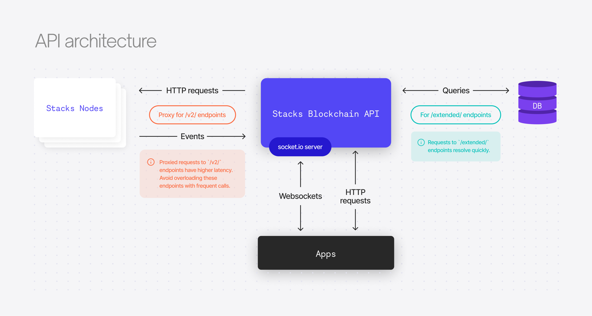

# Stacks Blockchain API Overview

The Stacks blockchain API allows you to query the Stacks blockchain and interact with smart contracts. It was built to maintain paginated, materialized views of the Stacks Blockchain.

The Stacks Blockchain API is hosted by Hiro. Using it requires you to trust us as the hosted server, but in return we provide a faster development experience. If you want a fully trustless architecture for your app, you may wish to consider running your own API instance.

> **_NOTE:_**
>
> To explore the detailed documentation for the API endpoints, request and response formats, you can refer to the [API Reference](https://docs.hiro.so/api).
>
> The source code for this project is available in our [GitHub repository](https://github.com/hirosystems/stacks-blockchain-api). You can explore the codebase, [contribute](https://docs.hiro.so/contributors-guide), and raise [issues](https://github.com/hirosystems/stacks-blockchain-api/issues) or [pull requests](https://github.com/hirosystems/stacks-blockchain-api/pulls).

## Architecture



- The `stacks-node` has its own minimal set of http endpoints referred to as `RPC endpoints`

  - The `stacks-blockchain-api` allows clients to access these endpoints by proxying them through to a load-balanced pool of `stacks-nodes`.
  - See: https://github.com/blockstack/stacks-blockchain/blob/master/docs/rpc-endpoints.md -- some common ones:
    - `POST /v2/transactions` - broadcast a transaction.
    - `GET /v2/pox` - get current PoX-relevant information.
    - `POST /v2/contracts/call-read/<contract>/<function>` - evaluate and return the result of calling a Clarity function.
    - `POST /v2/fees/transaction` - evaluate a given transaction and return transaction fee estimation data.
    - `GET /v2/accounts/<address>` - get the current `nonce` required for creating transactions.

- The endpoints implemented by `stacks-blockchain-api` provide data that the `stacks-node` can't due to various constraints.

  - Typically this is either data that the `stacks-node` doesn't persist, or data that it cannot efficiently serve to many clients.
    For example, the `stacks-node` can return the current STX balance of an account, but it can't return a history of account transactions.
  - The API also implements the Rosetta spec created by Coinbase -- "an open standard designed to simplify blockchain deployment and interaction."
    - See: https://www.rosetta-api.org/
  - The API also implements the BNS (Blockchain Naming System) endpoints.
    - See https://docs.stacks.co/build-apps/references/bns
  - See `/src/api/routes` for the Express.js routes.

- The API creates an "event observer" http server which listens for events from a `stacks-node` "event emitter"

  - These events are http POST requests that contain things like blocks, transactions, byproducts of executed transactions.
    - Transaction "byproducts" are things like asset transfers, smart-contract log data, execution cost data.
  - The API processes and stores these as relational data in postgres.
  - See `/src/event-stream` for the "event observer" code.

- All http endpoints and responses are defined in OpenAPI and JSON Schema.

  - See `/docs/openapi.yaml`
  - These are used to auto generate the docs at https://hirosystems.github.io/stacks-blockchain-api/
  - The JSON Schemas are converted into Typescript interfaces, which are used internally by the db controller module to transform SQL query results into the correct object shapes.
  - ALSO the OpenAPI + JSONSchemas are used to generate a standalone `@stacks/blockchain-api-client`.

- The easiest/quickest way to develop in this repo is using the VS Code debugger. It uses docker-compose to setup a `stacks-node` and Postgres instance.
  - Alternatively, you can run `npm run dev:integrated` which does the same thing but without a debugger.

## OpenAPI Spec

The Stacks API was designed using the [OpenAPI specification](https://swagger.io/specification/), making it compatible with a variety of developer tools.

The [OpenAPI specification file for Stacks](https://github.com/hirosystems/stacks-blockchain-api/blob/master/docs/openapi.yaml) is used to generate the TypeScript client library. You can use the specification file to generate client libraries for other programming languages using the [openapi-generator tool](https://github.com/OpenAPITools/openapi-generator)

### TypeScript client library

A Typescript client library is available for use of the Stacks API. The client library enables type-safe REST and WebSocket communication with the Stacks API endpoints.

The client is made up of three components:

1. Generated HTTP API client
2. Typescript definitions for [Clarity values](https://docs.hiro.so/stacks-blockchain-api/feature-guides/use-clarity-values)
3. WebSocket client

The following sections demonstrate common usages of the TypeScript API client.

### HTTP API client sample

The Typescript client library requires you to specify the underlying HTTP request library to handle HTTP communication. The example below uses the universal fetch API [`cross-fetch`](https://github.com/lquixada/cross-fetch):

```js
import fetch from 'cross-fetch';
import { Configuration, AccountsApi } from '@stacks/blockchain-api-client';
(async () => {
  const apiConfig = new Configuration({
    fetchApi: fetch,
    // for mainnet, replace `testnet` with `mainnet`
    basePath: 'https://api.testnet.hiro.so', // defaults to http://localhost:3999
  });
  // initiate the /accounts API with the basepath and fetch library
  const accountsApi = new AccountsApi(apiConfig);
  // get transactions for a specific account
  const txs = await accountsApi.getAccountTransactions({
    principal: 'ST000000000000000000002AMW42H',
  });
  console.log(txs);
})().catch(console.error);
```

### TypeScript sample

The following sample shows how generated [TypeScript models](https://github.com/hirosystems/stacks-blockchain-api/tree/master/client/src/generated/models) can be used for type-safety:

```ts
import fetch from 'cross-fetch';
import {
  Configuration,
  AccountsApi,
  AccountsApiInterface,
  AddressBalanceResponse,
  AddressBalanceResponseStx,
} from '@stacks/blockchain-api-client';
(async () => {
  const apiConfig: Configuration = new Configuration({
    fetchApi: fetch,
    // for mainnet, replace `testnet` with `mainnet`
    basePath: 'https://api.testnet.hiro.so', // defaults to http://localhost:3999
  });
  const principal: string = 'ST000000000000000000002AMW42H';
  // initiate the /accounts API with the basepath and fetch library
  const accountsApi: AccountsApiInterface = new AccountsApi(apiConfig);
  // get balance for a specific account
  const balance: AddressBalanceResponse = await accountsApi.getAccountBalance({
    principal,
  });
  // get STX balance details
  const stxAmount: AddressBalanceResponseStx = balance.stx;
  console.log(stxAmount);
})().catch(console.error);
```

### WebSocket sample

The WebSocket components enable you to subscribe to specific updates, providing a near real-time display of updates on transactions and accounts.

```js
import { connectWebSocketClient } from '@stacks/blockchain-api-client';
const client = await connectWebSocketClient('ws://stacks-node-api.blockstack.org/');
const sub = await client.subscribeAddressTransactions(contractCall.txId, event => {
  console.log(event);
});
await sub.unsubscribe();
```
