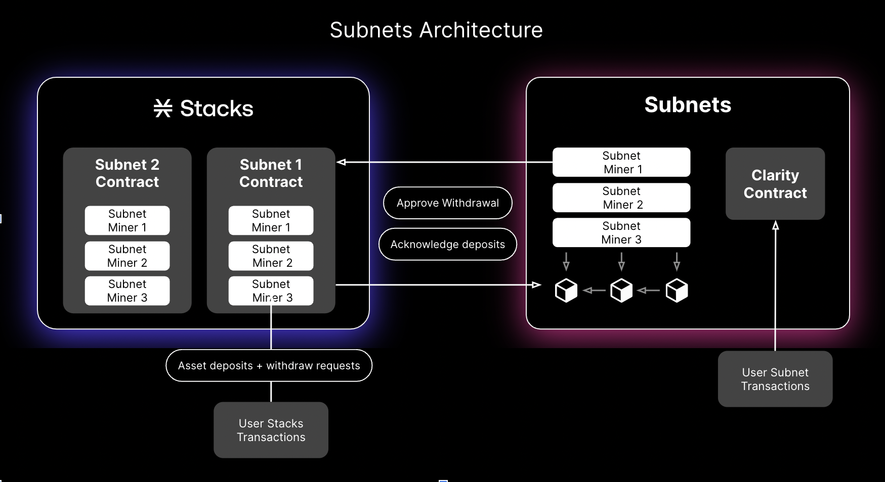

This diagram outlines the interaction between a subnet and the Stacks layer-1 chain.

## Features

A subnet is designed to temporarily hold Stacks assets. Users can deposit assets from the Stacks chain, take advantage of faster transactions and lower fees while on the subnet, and withdraw them when finished. While a user's assets are in a subnet, the asset is locked in the subnet contract on the Stacks chain, and representations of those assets are created—appearing in a user's Leather Wallet—and handled by applications on the subnet.

:::note

_The current subnet implementation relies on either a single block producer or a fully-trusted federation of block producers. Users of a subnet should be aware that they are sacrificing decentralization and security for the speed provided in the subnet, and therefore should only deposit assets into trusted subnets._

:::

Listed below are some of the features of a subnet:

- Each subnet may define its throughput settings. The default implementation should support at least 4x higher throughput for transactions and reduce confirmation time from 10 minutes to 1 minute.
- Interacting with a subnet is similar to interacting with a different Stacks network (for example testnet vs. mainnet).
- The Stacks blockchain may support many different subnets.
- Each subnet may use the same or different consensus rules.
- This repository implements a consensus mechanism that uses a two-phase commit among a federated pool of miners.
- FTs, NFTs, and STX deposits and withdrawals are supported via user-submitted L1 transactions.
- To deposit into a subnet, users submit a layer-1 transaction to invoke the deposit method on that subnet's smart contract.
- For withdrawals, users commit the withdrawal on the subnet and then submit a layer-1 transaction to invoke the subnet's smart contract's withdraw method.
