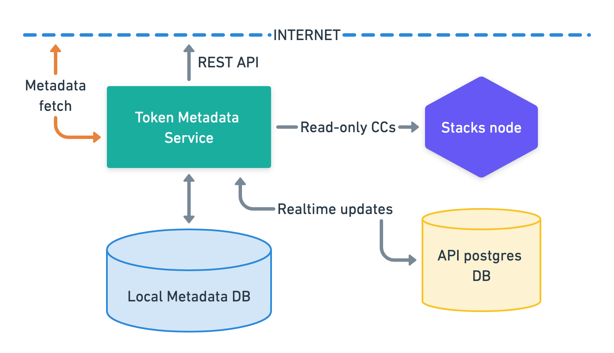
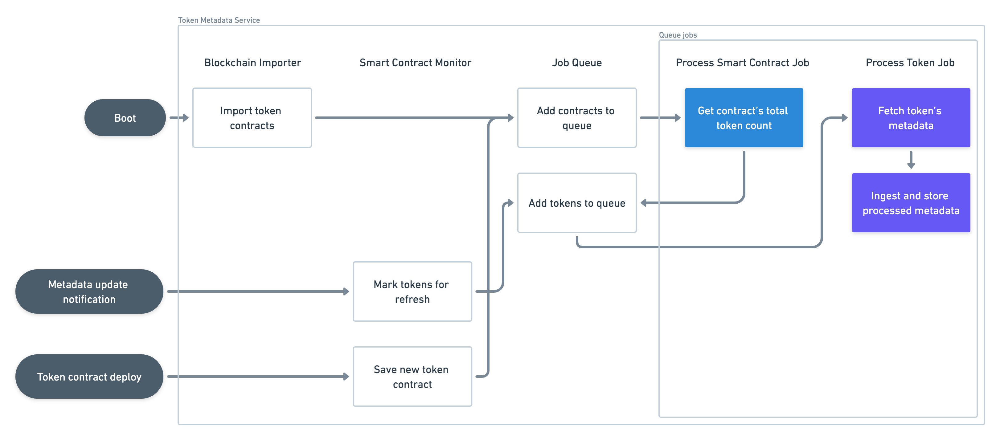

---

title: Overview

---

# API - Token Metadata Overview

Token metadata is a microservice that indexes metadata for all Fungible, Non-Fungible, and Semi-Fungible Tokens in the Stacks blockchain and exposes it via JSON REST API endpoints.

> **_NOTE:_**
>
> To explore the detailed documentation for the API endpoints, request and response formats, you can refer to the [OpenAPI specification](https://docs.hiro.so/metadata).
>
> The source code for this project is available in our [GitHub repository](https://github.com/hirosystems/token-metadata-api). You can explore the codebase, [contribute](https://docs.hiro.so/contributors-guide), and raise [issues](https://github.com/hirosystems/token-metadata-api/issues) or [pull requests](https://github.com/hirosystems/token-metadata-api/pulls).

## Service architecture

This section gives you an overview of external and internal architectural diagrams.

### External architecture

The external architectural diagram shows how the Token metadata API is connected to three systems: Stacks node, Stacks blockchain API database, and Postgres database.

1. Token metadata API interacts with the Stacks Blockchain API database( referred to as Local Metadata DB in the diagram) to import all historical smart contracts when booting up and to listen for new contracts that may be deployed. Read-only access is recommended as this service will never need to write anything to this database(DB).
2. A Stacks node to respond to all read-only contract calls required when fetching token metadata (calls to get token count, token metadata URIs, etc.).
3. A local Postgres DB to store all processed metadata info.

The service needs to fetch external metadata files (JSONs, images) from the internet, so it must have access to external networks.

### Internal architecture

The following is the internal architectural diagram of the Token metadata API.

#### Blockchain importer

The [`BlockchainImporter`](https://github.com/hirosystems/token-metadata-api/tree/master/src/token-processor/blockchain-api/blockchain-importer.ts) is a component in the Token metadata API that takes token contracts from the API database. This component is only used on service boot.

It connects to the Stacks Blockchain API database and scans the entire `smart_contracts` table looking for any contract that conforms to [SIP-009](https://github.com/stacksgov/sips/blob/main/sips/sip-009/sip-009-nft-standard.md), SIP-010 or SIP-013. When it finds a token contract, it creates a [`ProcessSmartContractJob`](https://github.com/hirosystems/token-metadata-api/tree/master/src/token-processor/queue/job/process-smart-contract-job.ts) and adds it to the [Job queue](#job-queue), ßso its tokens can be read and processed thereafter.

This process runs only once. If the Token metadata API is ever restarted, though, this component re-scans the API `smart_contracts` table from the last processed block height. It can pick up any newer contracts it might have missed while the service was unavailable.

#### Smart contract monitor

The [`BlockchainSmartContractMonitor`](https://github.com/hirosystems/token-metadata-api/tree/master/src/token-processor/blockchain-api/blockchain-smart-contract-monitor.ts) component constantly listens to the following Stacks Blockchain API events:

* **Smart contract log events**

    If a contract `print` event conforms to SIP-019, it finds the affected tokens and marks them for metadata refresh.

* **Smart contract deployments**

    If the new contract is a token contract, it saves the new token contract and adds the contract to the job queue for token processing.

This process is kept alive throughout the entire service lifetime.

#### Job queue

The role of the [`JobQueue`](https://github.com/hirosystems/token-metadata-api/tree/master/src/token-processor/queue/job-queue.ts) is to perform all the smart contract and token processing in the service.

It is a priority queue that organizes all necessary work for contract ingestion and token metadata processing. Every job this queue processes corresponds to one row in the `jobs` DB table, which marks its processing status and related objects to be worked on (smart contract or token).

This object essentially runs an infinite loop that follows these steps:

1. Upon `start(),` it fetches a set number of job rows that are `'pending'` and loads their corresponding `Job` objects into memory for processing, marking those rows now as `'queued'`.
2. It executes each loaded job to completion concurrently. The job row is marked as either `'done'` or `'failed'` depending on success or failure.
3. Once all loaded jobs are done (and the queue is now empty), it goes back to step 1.

There are two environment variables that can help you tune how the queue performs:

* `ENV.JOB_QUEUE_SIZE_LIMIT`: The in-memory size of the queue, i.e., the number of pending jobs that are loaded from the database while they wait for execution (see step 1 above).
* `ENV.JOB_QUEUE_CONCURRENCY_LIMIT`: The number of jobs that will be run simultaneously.

This queue runs continuously and can handle an unlimited number of jobs.

##### Process smart contract job

This job makes a contract call to the Stacks node to determine the total number of tokens declared by the given contract. Once determined, it creates and enqueues all these tokens for metadata ingestion.

##### Process token job

This job fetches the metadata JSON object for a single token and other relevant properties depending on the token type (symbol, decimals, etc.). Once fetched, it parses and ingests this data to save it into the local database for API endpoints to return.
